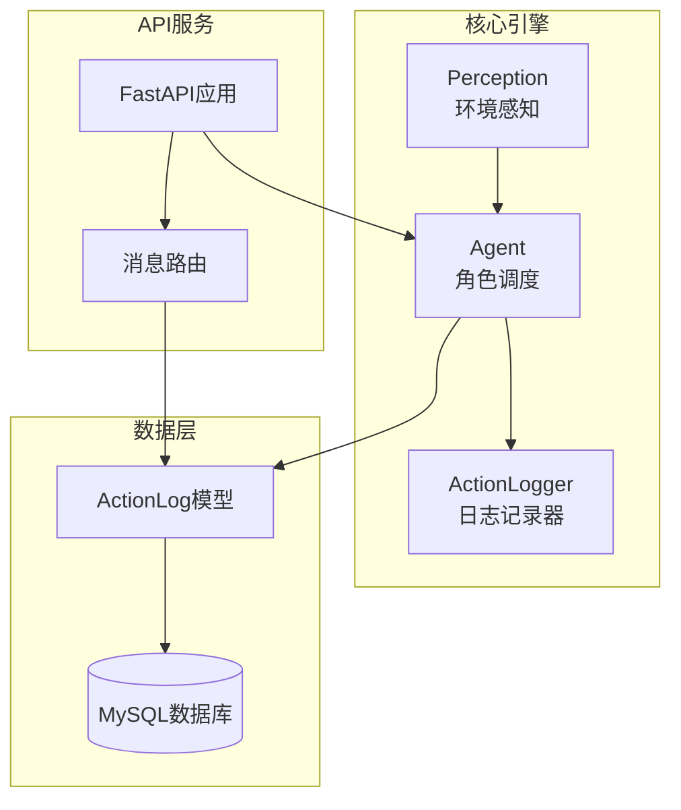
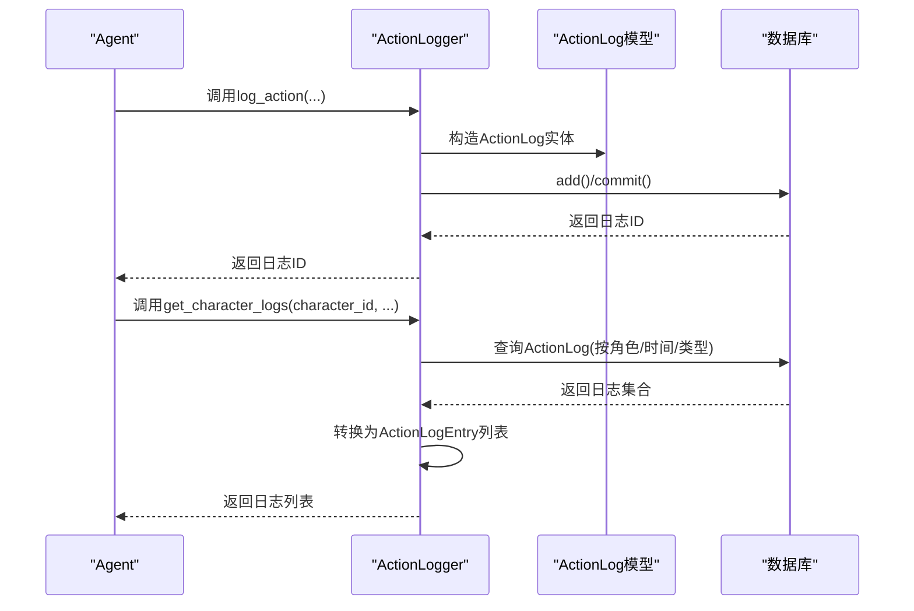
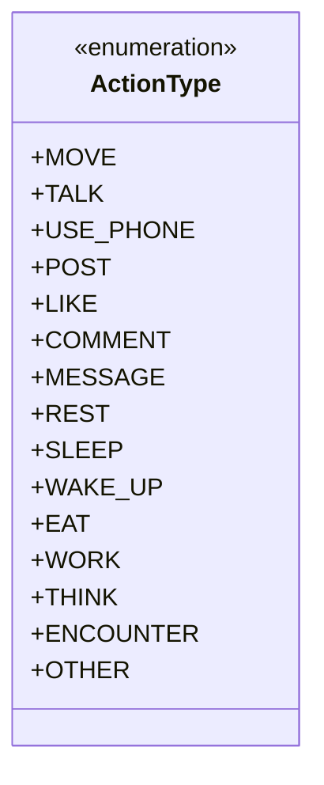
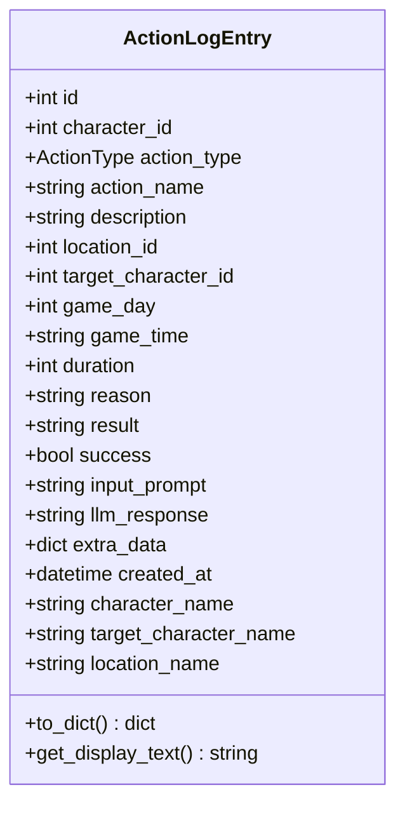
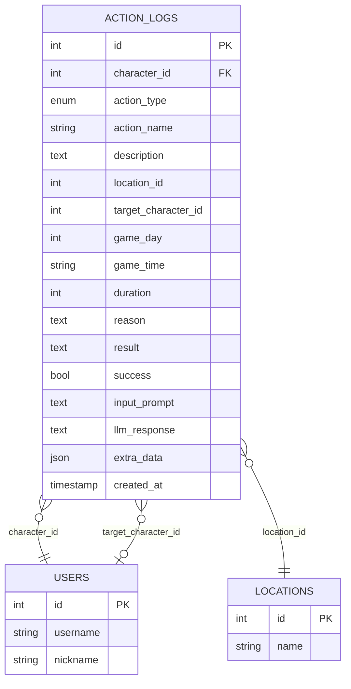
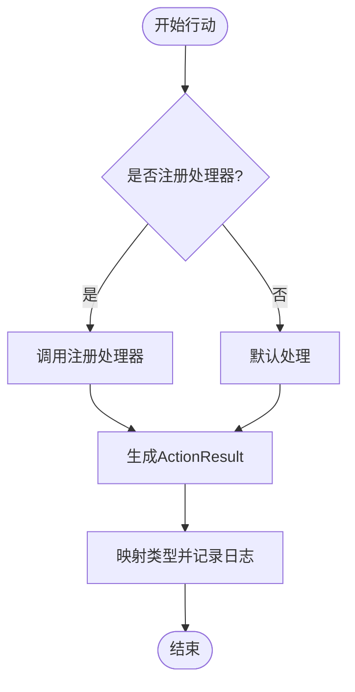
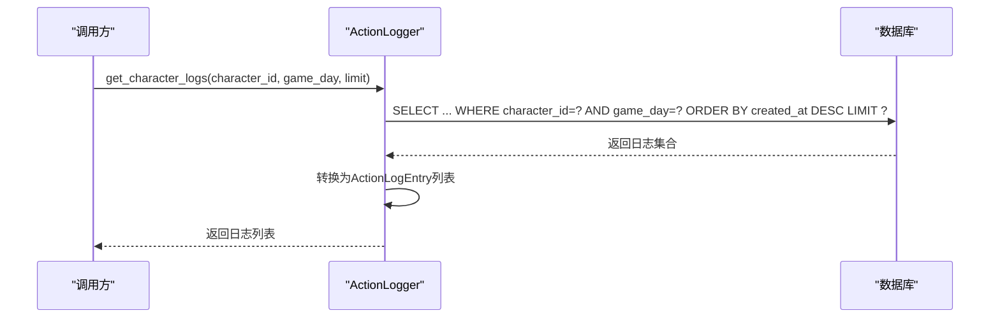
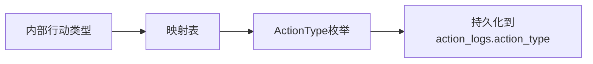
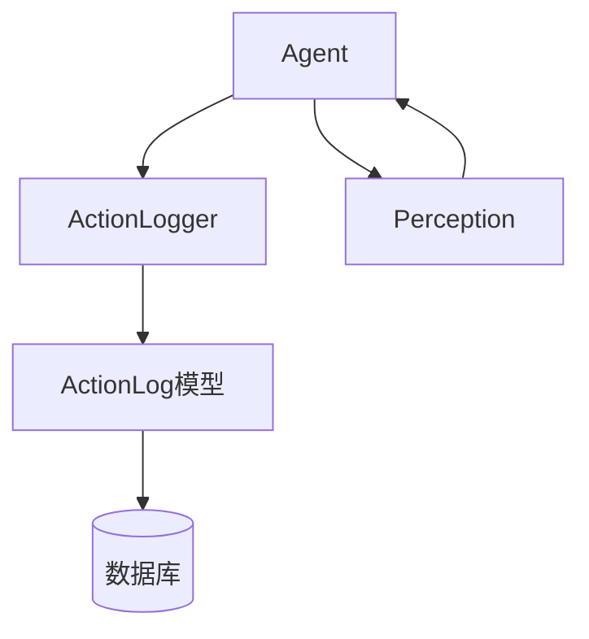

# 行动日志系统

<cite>
**本文档引用的文件**
- [action_logger.py](file://core_engine/character/action_logger.py)
- [models.py](file://api_server/models.py)
- [002_action_logs.sql](file://data/migrations/002_action_logs.sql)
- [agent.py](file://core_engine/character/agent.py)
- [perception.py](file://core_engine/character/perception.py)
- [messages.py](file://api_server/routers/messages.py)
- [main.py](file://api_server/main.py)
</cite>

## 目录
1. [简介](#简介)
2. [项目结构](#项目结构)
3. [核心组件](#核心组件)
4. [架构总览](#架构总览)
5. [详细组件分析](#详细组件分析)
6. [依赖关系分析](#依赖关系分析)
7. [性能考量](#性能考量)
8. [故障排查指南](#故障排查指南)
9. [结论](#结论)
10. [附录](#附录)

## 简介
本文件为行动日志系统的技术文档，面向开发者与运维人员，系统性阐述ActionLogger的设计架构、日志记录格式、持久化策略、数据结构与查询接口，并提供扩展开发指南与性能优化建议。该系统围绕AI角色的行动进行追踪，支持按角色、时间、行动类型等维度进行查询与可视化，同时记录LLM交互过程以支撑可追溯的决策分析。

## 项目结构
行动日志系统主要分布在以下模块：
- 核心日志记录：core_engine/character/action_logger.py
- 数据模型与数据库迁移：api_server/models.py、data/migrations/002_action_logs.sql
- 角色调度与日志使用：core_engine/character/agent.py、core_engine/character/perception.py
- API路由与集成：api_server/routers/messages.py、api_server/main.py

图表来源
- [agent.py](file://core_engine/character/agent.py#L116-L170)
- [action_logger.py](file://core_engine/character/action_logger.py#L89-L102)
- [models.py](file://api_server/models.py#L254-L293)
- [messages.py](file://api_server/routers/messages.py#L1-L300)
- [main.py](file://api_server/main.py#L1-L69)

章节来源
- [action_logger.py](file://core_engine/character/action_logger.py#L1-L481)
- [models.py](file://api_server/models.py#L1-L293)
- [002_action_logs.sql](file://data/migrations/002_action_logs.sql#L1-L44)
- [agent.py](file://core_engine/character/agent.py#L1-L800)
- [perception.py](file://core_engine/character/perception.py#L1-L200)
- [messages.py](file://api_server/routers/messages.py#L1-L300)
- [main.py](file://api_server/main.py#L1-L69)

## 核心组件
- 行动类型枚举（ActionType）：定义了移动、对话、使用手机、发帖、点赞、评论、私聊、休息、睡觉、醒来、吃饭、工作、思考、相遇、其他等15种行动类型。
- 日志条目数据结构（ActionLogEntry）：封装了日志的字段与序列化逻辑，便于前端展示与导出。
- 日志记录器（ActionLogger）：负责记录与查询日志，提供通用log_action与多种便捷方法（如log_move、log_talk等），并支持按角色、时间、类型筛选。
- 数据模型（ActionLog）：ORM模型，映射到数据库表action_logs，包含索引与外键约束。
- 数据库迁移脚本：定义了表结构、索引与外键，确保查询性能与数据一致性。

章节来源
- [action_logger.py](file://core_engine/character/action_logger.py#L13-L30)
- [action_logger.py](file://core_engine/character/action_logger.py#L32-L87)
- [action_logger.py](file://core_engine/character/action_logger.py#L89-L481)
- [models.py](file://api_server/models.py#L235-L252)
- [models.py](file://api_server/models.py#L254-L293)
- [002_action_logs.sql](file://data/migrations/002_action_logs.sql#L7-L43)

## 架构总览
ActionLogger采用“记录器+ORM模型+数据库”的三层架构：
- 记录层：ActionLogger提供统一的日志入口，内部将日志持久化到数据库。
- 查询层：ActionLogger提供按角色、时间、类型筛选的查询接口，支持最近日志与角色日志两类查询。
- 展示层：ActionLogEntry提供to_dict与显示文本生成，便于前端渲染。

图表来源
- [agent.py](file://core_engine/character/agent.py#L523-L566)
- [action_logger.py](file://core_engine/character/action_logger.py#L103-L161)
- [action_logger.py](file://core_engine/character/action_logger.py#L406-L466)
- [models.py](file://api_server/models.py#L254-L293)

## 详细组件分析

### 行动类型分类（ActionType枚举）
- 类型覆盖：移动、对话、使用手机、发帖、点赞、评论、私聊、休息、睡觉、醒来、吃饭、工作、思考、相遇、其他。
- 设计原则：统一抽象AI角色的典型行为，便于后续扩展与统计分析。

图表来源
- [action_logger.py](file://core_engine/character/action_logger.py#L13-L30)

章节来源
- [action_logger.py](file://core_engine/character/action_logger.py#L13-L30)

### 日志记录格式与数据结构
- ActionLogEntry字段：包含基础字段（角色ID、行动类型、名称、描述、时间、持续时间、结果、成功标志）、LLM交互字段（输入prompt、LLM响应）、额外数据（JSON）与显示增强字段（角色名、目标角色名、地点名）。
- 序列化：to_dict方法输出标准化字典，便于API返回与前端渲染；get_display_text生成人类可读的展示文本。

图表来源
- [action_logger.py](file://core_engine/character/action_logger.py#L32-L87)

章节来源
- [action_logger.py](file://core_engine/character/action_logger.py#L32-L87)

### 日志持久化策略
- ORM模型：ActionLog映射到action_logs表，包含主键、外键、索引与JSON字段。
- 外键约束：character_id、location_id、target_character_id分别关联users、locations、users，保证引用完整性。
- 索引设计：idx_character、idx_created_at、idx_character_time、idx_game_day提升查询效率。
- 迁移脚本：002_action_logs.sql定义了完整的DDL与索引。

图表来源
- [models.py](file://api_server/models.py#L254-L293)
- [002_action_logs.sql](file://data/migrations/002_action_logs.sql#L7-L43)

章节来源
- [models.py](file://api_server/models.py#L254-L293)
- [002_action_logs.sql](file://data/migrations/002_action_logs.sql#L1-L44)

### 日志记录机制与类型映射
- 通用记录：log_action接受完整参数，直接持久化。
- 便捷记录：log_move、log_talk、log_use_phone、log_post、log_like、log_comment、log_message、log_rest、log_sleep、log_wake_up、log_think、log_encounter等方法封装常用场景。
- 类型映射：Agent在执行行动后，将默认行动类型映射到ActionType，确保日志类型与实际行为一致。

图表来源
- [agent.py](file://core_engine/character/agent.py#L479-L522)
- [agent.py](file://core_engine/character/agent.py#L523-L566)

章节来源
- [action_logger.py](file://core_engine/character/action_logger.py#L103-L334)
- [agent.py](file://core_engine/character/agent.py#L479-L566)

### 日志查询接口
- 最近日志：get_recent_logs支持按角色与类型筛选，按创建时间倒序返回。
- 角色日志：get_character_logs支持按角色与游戏日筛选，按创建时间倒序返回。
- 结果转换：查询结果转换为ActionLogEntry列表，自动补充角色名、目标角色名、地点名等显示信息。

图表来源
- [action_logger.py](file://core_engine/character/action_logger.py#L406-L466)

章节来源
- [action_logger.py](file://core_engine/character/action_logger.py#L336-L466)

### 日志类型映射与扩展
- 类型映射：Agent中定义了默认映射表，将内部行动类型映射到ActionType，便于统一记录。
- 扩展方式：新增行动类型时，需同步更新ActionType、ActionLogType以及映射表，并在相应场景下调用log_action或对应便捷方法。

图表来源
- [agent.py](file://core_engine/character/agent.py#L528-L548)

章节来源
- [agent.py](file://core_engine/character/agent.py#L528-L548)

### 日志统计分析功能
- 基础统计：可通过查询接口按角色、时间、类型聚合，结合前端进行可视化。
- LLM交互：input_prompt与llm_response字段可用于审计与分析LLM决策过程。
- 建议：可在API层新增统计接口，如按日/周/月汇总行动次数、平均时长、成功率等。

章节来源
- [action_logger.py](file://core_engine/character/action_logger.py#L336-L466)
- [models.py](file://api_server/models.py#L270-L285)

## 依赖关系分析
- ActionLogger依赖API层的models.ActionLog与数据库会话。
- Agent在执行行动时依赖ActionLogger，并在感知与决策阶段使用日志进行上下文补充。
- Perception提供物理状态与可用行动，间接影响日志记录的合理性与丰富度。

图表来源
- [action_logger.py](file://core_engine/character/action_logger.py#L96-L102)
- [agent.py](file://core_engine/character/agent.py#L116-L170)
- [perception.py](file://core_engine/character/perception.py#L1-L200)
- [models.py](file://api_server/models.py#L254-L293)

章节来源
- [action_logger.py](file://core_engine/character/action_logger.py#L96-L102)
- [agent.py](file://core_engine/character/agent.py#L116-L170)
- [perception.py](file://core_engine/character/perception.py#L1-L200)
- [models.py](file://api_server/models.py#L254-L293)

## 性能考量
- 索引优化：已建立多处索引（角色、时间、角色+时间、游戏日），建议在高频查询上进一步评估复合索引效果。
- 查询限制：查询接口提供limit参数，避免一次性返回大量数据。
- 数据量控制：建议引入日志清理策略（见扩展开发指南），防止表膨胀影响查询性能。
- I/O优化：批量插入与事务提交应谨慎使用，避免频繁小事务导致性能下降。

章节来源
- [002_action_logs.sql](file://data/migrations/002_action_logs.sql#L39-L43)
- [action_logger.py](file://core_engine/character/action_logger.py#L336-L466)

## 故障排查指南
- 数据库连接问题：ActionLogger在无数据库会话时会打印日志并返回None，检查数据库连接与会话注入。
- 查询异常：get_recent_logs与get_character_logs捕获异常并返回空列表，检查SQL语法与权限。
- LLM交互：input_prompt与llm_response字段用于审计，若为空可能意味着未正确传递或记录。

章节来源
- [action_logger.py](file://core_engine/character/action_logger.py#L127-L160)
- [action_logger.py](file://core_engine/character/action_logger.py#L402-L404)
- [action_logger.py](file://core_engine/character/action_logger.py#L464-L466)

## 结论
行动日志系统通过清晰的类型抽象、完善的持久化模型与灵活的查询接口，为AI角色的行为追踪提供了坚实基础。配合Agent的决策与执行流程，系统能够记录完整的行动轨迹与LLM交互过程，便于后续的可视化、审计与分析。建议在生产环境中配合日志清理策略与监控告警，确保长期稳定运行。

## 附录

### 扩展开发指南
- 新增日志类型
  - 在ActionType与ActionLogType中添加新枚举值。
  - 在Agent的映射表中添加对应映射。
  - 在ActionLogger中新增便捷方法或在调用处使用log_action。
- 自定义日志格式
  - 修改ActionLogEntry的to_dict与显示逻辑，以适配新的展示需求。
- 日志清理策略
  - 建议按角色与时间维度定期归档或删除过期日志，避免表过大。
  - 可在API层新增清理接口，支持按天/周/月清理。

章节来源
- [action_logger.py](file://core_engine/character/action_logger.py#L13-L30)
- [action_logger.py](file://core_engine/character/action_logger.py#L32-L87)
- [agent.py](file://core_engine/character/agent.py#L528-L548)