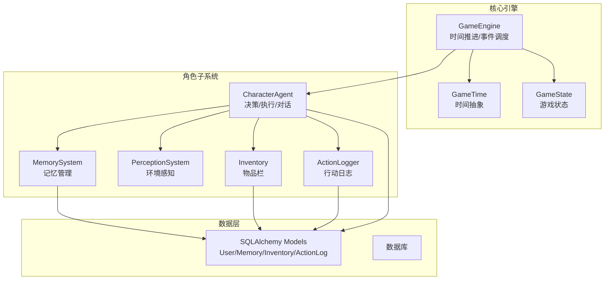
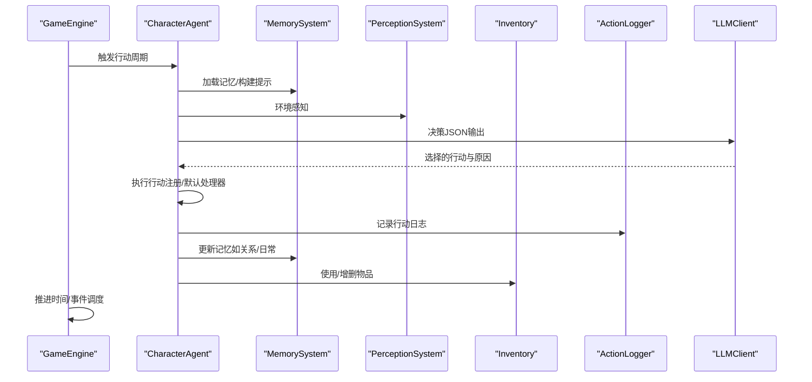
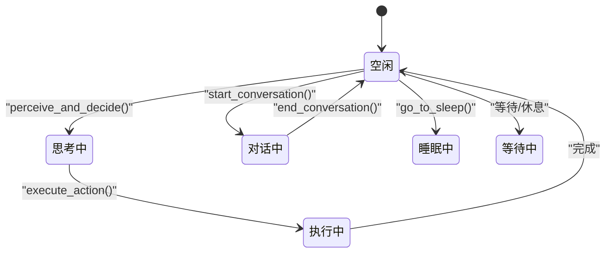
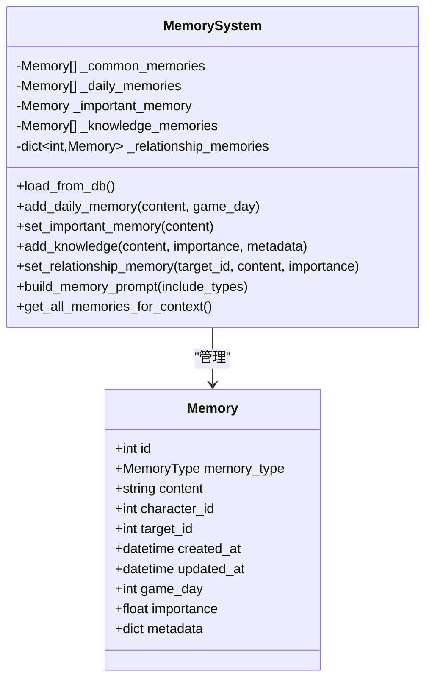
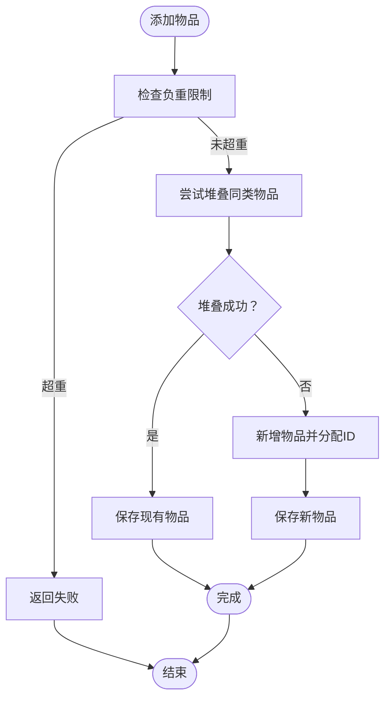
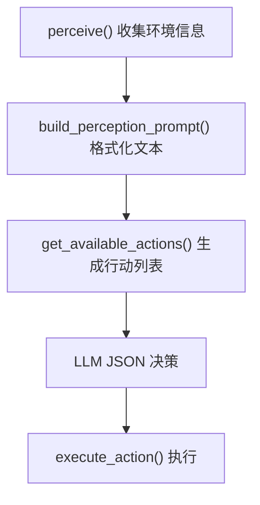
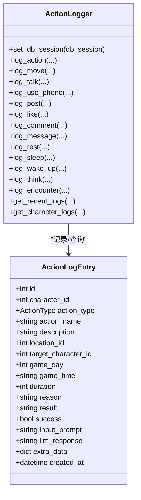
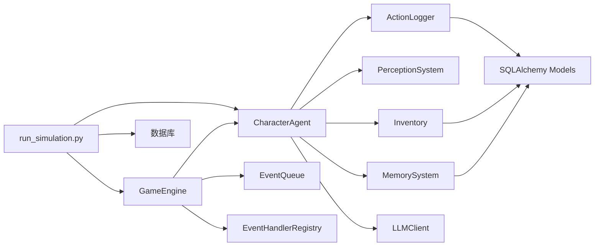

# 角色Agent系统

<cite>
**本文引用的文件**
- [core_engine/character/agent.py](file://core_engine/character/agent.py)
- [core_engine/character/memory.py](file://core_engine/character/memory.py)
- [core_engine/character/inventory.py](file://core_engine/character/inventory.py)
- [core_engine/character/perception.py](file://core_engine/character/perception.py)
- [core_engine/character/action_logger.py](file://core_engine/character/action_logger.py)
- [core_engine/engine.py](file://core_engine/engine.py)
- [api_server/models.py](file://api_server/models.py)
- [shared/config.py](file://shared/config.py)
- [run_simulation.py](file://run_simulation.py)
</cite>

## 目录
1. [简介](#简介)
2. [项目结构](#项目结构)
3. [核心组件](#核心组件)
4. [架构总览](#架构总览)
5. [详细组件分析](#详细组件分析)
6. [依赖关系分析](#依赖关系分析)
7. [性能考量](#性能考量)
8. [故障排查指南](#故障排查指南)
9. [结论](#结论)
10. [附录](#附录)

## 简介
本技术文档围绕角色Agent系统进行深入剖析，涵盖CharacterAgent的设计架构、角色状态管理、决策循环与行动执行机制；记忆系统（MemorySystem）的数据结构、记忆类型分类与持久化策略；物品栏系统（Inventory）的物品管理、负重计算与物品模板系统；环境感知系统（PerceptionSystem）的信息收集机制与可用行动识别算法；行动日志系统（ActionLogger）的记录格式、日志分类与持久化方案。同时提供角色扩展开发的最佳实践与性能优化建议，帮助开发者高效理解与扩展该系统。

## 项目结构
该项目采用分层与功能域结合的组织方式：
- 核心引擎层：时间管理、事件调度、世界状态（engine.py）
- 角色子系统：Agent、记忆、感知、物品栏、日志（core_engine/character/*）
- 数据模型与持久化：SQLAlchemy模型（api_server/models.py）
- 配置与入口：共享配置（shared/config.py）、模拟运行入口（run_simulation.py）



图表来源
- [core_engine/engine.py](file://core_engine/engine.py#L167-L429)
- [core_engine/character/agent.py](file://core_engine/character/agent.py#L116-L180)
- [api_server/models.py](file://api_server/models.py#L35-L293)

章节来源
- [core_engine/engine.py](file://core_engine/engine.py#L1-L429)
- [core_engine/character/agent.py](file://core_engine/character/agent.py#L1-L1271)
- [api_server/models.py](file://api_server/models.py#L1-L293)

## 核心组件
- CharacterAgent：统一的AI角色控制器，整合记忆、感知、决策、执行、对话、计划等功能，负责角色状态机与行动生命周期管理。
- MemorySystem：管理角色的共同记忆、日常记忆、重要记忆、知识记忆、关系记忆，支持加载、保存、检索与提示词构建。
- PerceptionSystem：采集环境信息（位置、天气、人物、地点、物体），并根据物理状态与环境生成可用行动列表。
- Inventory：维护物品栏，支持堆叠、耐久、负重限制、物品模板与持久化。
- ActionLogger：记录行动日志，支持类型化分类、查询与可视化，便于调试与审计。
- GameEngine：时间推进器与事件调度器，驱动角色Agent按时间步执行行动。

章节来源
- [core_engine/character/agent.py](file://core_engine/character/agent.py#L116-L180)
- [core_engine/character/memory.py](file://core_engine/character/memory.py#L92-L120)
- [core_engine/character/perception.py](file://core_engine/character/perception.py#L211-L304)
- [core_engine/character/inventory.py](file://core_engine/character/inventory.py#L194-L227)
- [core_engine/character/action_logger.py](file://core_engine/character/action_logger.py#L89-L120)
- [core_engine/engine.py](file://core_engine/engine.py#L167-L210)

## 架构总览
角色Agent系统通过CharacterAgent协调各子系统，借助LLMClient进行推理与对话，通过ActionLogger记录行动轨迹，通过MemorySystem沉淀经验，通过PerceptionSystem感知环境，通过Inventory管理资源，最终由GameEngine驱动时间推进与事件调度。



图表来源
- [core_engine/character/agent.py](file://core_engine/character/agent.py#L358-L522)
- [core_engine/character/action_logger.py](file://core_engine/character/action_logger.py#L103-L161)
- [core_engine/engine.py](file://core_engine/engine.py#L288-L382)

## 详细组件分析

### CharacterAgent 设计与状态管理
- 状态机：IDLE、THINKING、ACTING、TALKING、SLEEPING、WAITING，贯穿每日流程与行动执行。
- 每日流程：唤醒（生成当日计划）、睡眠（总结当日事件为日常记忆）。
- 决策循环：感知环境→填充关系记忆→生成可用行动→LLM JSON决策→执行行动→记录日志→更新疲劳。
- 对话系统：开始/回复/结束对话，结束时总结并更新关系记忆。
- 社交行为：浏览帖子、发帖、查看主页、私信等，均通过默认处理器或社交调度器实现。
- 状态查询：提供get_status/get_context_for_event，便于外部监控与事件处理。



图表来源
- [core_engine/character/agent.py](file://core_engine/character/agent.py#L21-L29)
- [core_engine/character/agent.py](file://core_engine/character/agent.py#L225-L289)
- [core_engine/character/agent.py](file://core_engine/character/agent.py#L358-L478)

章节来源
- [core_engine/character/agent.py](file://core_engine/character/agent.py#L116-L180)
- [core_engine/character/agent.py](file://core_engine/character/agent.py#L225-L355)
- [core_engine/character/agent.py](file://core_engine/character/agent.py#L358-L522)
- [core_engine/character/agent.py](file://core_engine/character/agent.py#L829-L958)
- [core_engine/character/agent.py](file://core_engine/character/agent.py#L1148-L1171)

### MemorySystem 数据结构与持久化
- 记忆类型：COMMON（共同设定）、DAILY（每日记忆，最多14条）、IMPORTANT（重要记忆，最长1000字符）、KNOWLEDGE（知识记忆，最多50条）、RELATIONSHIP（关系记忆，每目标唯一）。
- 数据结构：Memory类包含content、target_id、importance、metadata、game_day等字段；MemorySystem内部以列表/字典缓存不同类型记忆。
- 持久化：load_from_db从数据库加载，_save_to_db/_delete_from_db进行CRUD；数据库字段与枚举值存在“relation/relationship”映射与1-10重要度转换。
- 提示词构建：build_memory_prompt按类型组合文本，get_all_memories_for_context提供上下文字典。
- 限制与清理：每日记忆上限、重要记忆长度限制、知识记忆按重要度淘汰。



图表来源
- [core_engine/character/memory.py](file://core_engine/character/memory.py#L24-L90)
- [core_engine/character/memory.py](file://core_engine/character/memory.py#L92-L167)
- [core_engine/character/memory.py](file://core_engine/character/memory.py#L168-L250)

章节来源
- [core_engine/character/memory.py](file://core_engine/character/memory.py#L14-L104)
- [core_engine/character/memory.py](file://core_engine/character/memory.py#L119-L167)
- [core_engine/character/memory.py](file://core_engine/character/memory.py#L168-L250)
- [core_engine/character/memory.py](file://core_engine/character/memory.py#L444-L492)

### Inventory 物品管理与负重计算
- 物品类型：TOOL、FOOD、MATERIAL、PHOTO、DOCUMENT、GIFT、CURRENCY、EQUIPMENT、MISC。
- 数据结构：Item类包含name、item_type、weight、quantity、stackable、max_stack、durability/max_durability、metadata、obtained_at等；Inventory以字典管理物品。
- 负重与堆叠：current_weight/available_weight/is_overweight；can_add/add/remove/use_item；堆叠逻辑与分割逻辑。
- 模板系统：ItemTemplates提供常用模板（手机、食物、货币、照片）。
- 持久化：load_from_db/_save_to_db/_delete_from_db，properties JSON存储扩展属性。



图表来源
- [core_engine/character/inventory.py](file://core_engine/character/inventory.py#L324-L358)
- [core_engine/character/inventory.py](file://core_engine/character/inventory.py#L339-L355)

章节来源
- [core_engine/character/inventory.py](file://core_engine/character/inventory.py#L14-L192)
- [core_engine/character/inventory.py](file://core_engine/character/inventory.py#L194-L308)
- [core_engine/character/inventory.py](file://core_engine/character/inventory.py#L309-L474)
- [core_engine/character/inventory.py](file://core_engine/character/inventory.py#L478-L547)

### PerceptionSystem 环境感知与可用行动识别
- 身体状态：PhysicalState包含fatigue、hunger、health、emotion，提供阈值判断与描述文本。
- 环境感知：EnvironmentPerception包含位置、天气、季节、温度、附近角色、附近对象、附近地点、身体状态。
- 可用行动：get_available_actions根据环境与状态生成行动列表，包含等待、观察、移动、对话、互动、休息、睡觉、室内社交等。
- 提示词构建：build_perception_prompt将感知结果格式化为文本，供LLM决策。



图表来源
- [core_engine/character/perception.py](file://core_engine/character/perception.py#L226-L304)
- [core_engine/character/perception.py](file://core_engine/character/perception.py#L320-L394)
- [core_engine/character/perception.py](file://core_engine/character/perception.py#L395-L528)

章节来源
- [core_engine/character/perception.py](file://core_engine/character/perception.py#L24-L124)
- [core_engine/character/perception.py](file://core_engine/character/perception.py#L149-L210)
- [core_engine/character/perception.py](file://core_engine/character/perception.py#L226-L304)
- [core_engine/character/perception.py](file://core_engine/character/perception.py#L395-L528)

### ActionLogger 行动日志记录与查询
- 日志类型：MOVE、TALK、USE_PHONE、POST、LIKE、COMMENT、MESSAGE、REST、SLEEP、WAKE_UP、EAT、WORK、THINK、ENCOUNTER、OTHER。
- 数据结构：ActionLogEntry包含角色、类型、名称、描述、地点、目标角色、时间、时长、原因、结果、LLM输入/响应、额外数据等。
- 记录接口：log_action/log_move/log_talk/log_use_phone/log_post/log_like/log_comment/log_message/log_rest/log_sleep/log_wake_up/log_think/log_encounter。
- 查询接口：get_recent_logs/get_character_logs，支持按角色、类型、日期筛选。



图表来源
- [core_engine/character/action_logger.py](file://core_engine/character/action_logger.py#L32-L87)
- [core_engine/character/action_logger.py](file://core_engine/character/action_logger.py#L89-L161)
- [core_engine/character/action_logger.py](file://core_engine/character/action_logger.py#L336-L467)

章节来源
- [core_engine/character/action_logger.py](file://core_engine/character/action_logger.py#L13-L30)
- [core_engine/character/action_logger.py](file://core_engine/character/action_logger.py#L89-L161)
- [core_engine/character/action_logger.py](file://core_engine/character/action_logger.py#L336-L467)

### GameEngine 时间推进与事件调度
- 时间抽象：GameTime以分钟为单位，提供day/hour/minute/time_of_day/is_daytime等属性。
- 引擎状态：STOPPED/RUNNING/PAUSED，支持暂停/恢复。
- 主循环：等待暂停、取事件、推进时间至事件、执行事件、回调通知、推进事件时长。
- 状态持久化：save_state/load_state，保存GameState与事件队列。

```mermaid
sequenceDiagram
participant Loop as "主循环"
participant Queue as "事件队列"
participant Handler as "事件处理器"
participant Engine as "GameEngine"
Loop->>Queue : peek()
alt 无事件
Loop->>Engine : _advance_time(1)
else 有待执行事件
Loop->>Loop : 推进时间到事件开始
Loop->>Queue : pop()
Loop->>Handler : execute(event)
Handler-->>Loop : 成功/失败
Loop->>Engine : _advance_time(event.duration)
end
```

图表来源
- [core_engine/engine.py](file://core_engine/engine.py#L288-L382)

章节来源
- [core_engine/engine.py](file://core_engine/engine.py#L19-L110)
- [core_engine/engine.py](file://core_engine/engine.py#L167-L210)
- [core_engine/engine.py](file://core_engine/engine.py#L288-L382)
- [core_engine/engine.py](file://core_engine/engine.py#L383-L429)

## 依赖关系分析
- CharacterAgent依赖MemorySystem、PerceptionSystem、Inventory、ActionLogger、LLMClient。
- MemorySystem/Inventory/ActionLogger依赖SQLAlchemy模型与数据库会话。
- GameEngine依赖事件队列与事件处理器注册表，驱动Agent行动。
- run_simulation.py提供模拟入口，连接数据库、创建Agent并驱动模拟。



图表来源
- [core_engine/character/agent.py](file://core_engine/character/agent.py#L14-L18)
- [api_server/models.py](file://api_server/models.py#L63-L293)
- [core_engine/engine.py](file://core_engine/engine.py#L178-L194)
- [run_simulation.py](file://run_simulation.py#L17-L29)

章节来源
- [core_engine/character/agent.py](file://core_engine/character/agent.py#L14-L18)
- [api_server/models.py](file://api_server/models.py#L63-L293)
- [core_engine/engine.py](file://core_engine/engine.py#L178-L194)
- [run_simulation.py](file://run_simulation.py#L17-L29)

## 性能考量
- LLM调用频率与成本：决策循环与对话均涉及LLM调用，建议：
  - 合理设置temperature与max_tokens，避免过度生成。
  - 缓存常用提示词片段（如系统提示、记忆片段）。
  - 控制对话历史长度，避免上下文过长导致延迟与成本上升。
- 数据库访问：
  - 批量读取与写入，减少频繁commit。
  - 使用索引字段（如character_id、game_day、created_at）优化查询。
- 记忆与物品管理：
  - 限制记忆数量与长度，定期清理过期记忆。
  - 物品堆叠与耐久逻辑避免频繁写入，合并更新。
- 并发与异步：
  - 使用asyncio与异步数据库会话，避免阻塞。
  - 控制并发数量，防止LLM服务过载。
- 时间推进：
  - 事件队列冲突检测与去重，避免重复执行。
  - 批量推进时间，减少回调次数。

## 故障排查指南
- 数据库连接问题：
  - 检查数据库URL与凭据（shared/config.py）。
  - 确认表结构存在（run_simulation.py中create_all）。
- 记忆/物品/日志加载失败：
  - 检查数据库字段映射（如memory_type的“relation/relationship”差异）。
  - 确认JSON字段解析（metadata/properties）。
- LLM调用异常：
  - 检查LLM客户端配置与可用性。
  - 降低temperature或max_tokens，避免超时。
- 行动日志缺失：
  - 确认ActionLogger.set_db_session已正确设置。
  - 检查日志记录接口调用链（_log_action_result）。
- Agent状态异常：
  - 检查状态机流转（AgentState）与回调注册。
  - 使用get_status查看Agent状态与统计。

章节来源
- [shared/config.py](file://shared/config.py#L40-L47)
- [run_simulation.py](file://run_simulation.py#L244-L249)
- [core_engine/character/memory.py](file://core_engine/character/memory.py#L168-L250)
- [core_engine/character/action_logger.py](file://core_engine/character/action_logger.py#L127-L161)
- [core_engine/character/agent.py](file://core_engine/character/agent.py#L523-L566)

## 结论
角色Agent系统通过清晰的职责划分与模块化设计，实现了从感知、记忆、决策到执行与日志的完整闭环。MemorySystem与ActionLogger确保经验沉淀与可追溯性，PerceptionSystem与Inventory保障环境与资源的真实反馈，GameEngine提供稳定的时间推进与事件调度。遵循本文最佳实践与性能优化建议，可进一步提升系统的稳定性、可扩展性与运行效率。

## 附录
- 角色扩展开发建议：
  - 新增行动：在CharacterAgent.register_action_handler注册处理器，或在_perceptual_action_handler中扩展可用行动。
  - 新增记忆类型：在MemoryType与MemorySystem中扩展，注意数据库字段映射与限制。
  - 新增物品类型：在ItemType与ItemTemplates中扩展，确保堆叠与耐久逻辑一致。
  - 新增日志类型：在ActionType与ActionLogger中扩展，保证查询与展示一致性。
- 性能优化清单：
  - 合理缓存提示词与常用数据。
  - 批量数据库操作与索引优化。
  - 控制LLM调用频率与上下文长度。
  - 使用异步与并发控制，避免阻塞。
  - 定期清理过期数据与日志。