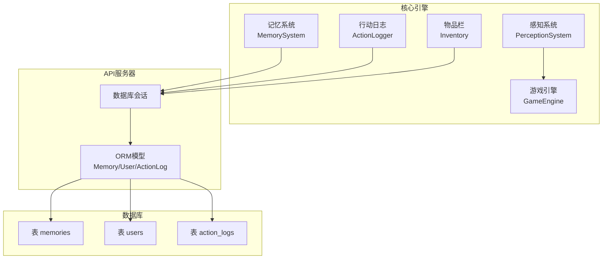
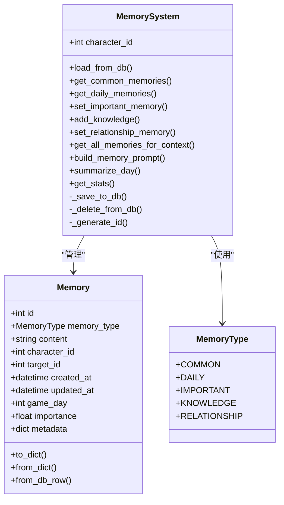
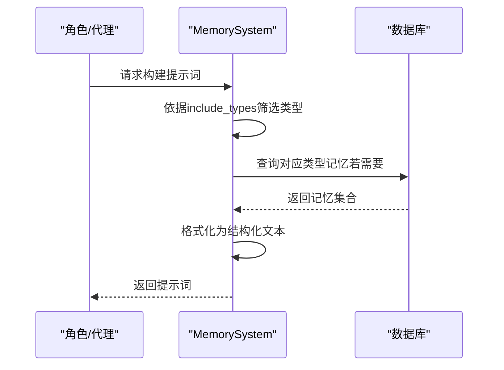
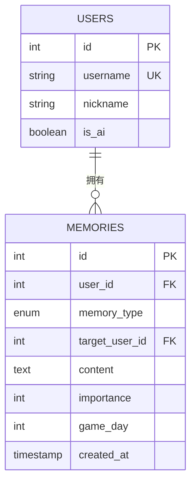
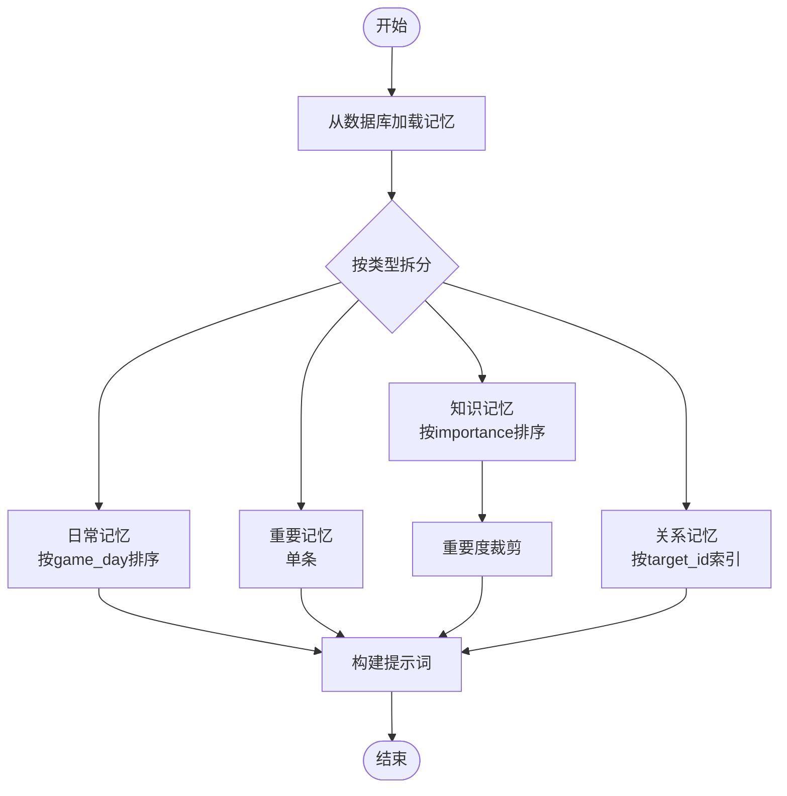
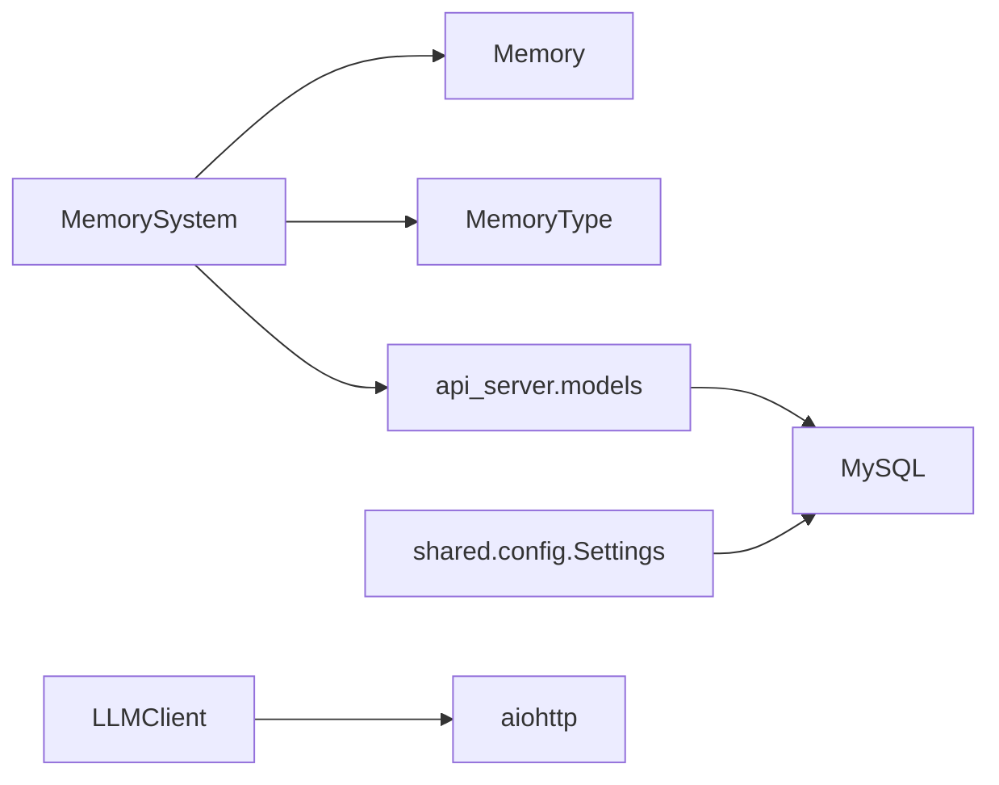

# 记忆系统

<cite>
**本文引用的文件**
- [core_engine/character/memory.py](file://core_engine/character/memory.py)
- [api_server/models.py](file://api_server/models.py)
- [data/migrations/001_init.sql](file://data/migrations/001_init.sql)
- [data/migrations/002_action_logs.sql](file://data/migrations/002_action_logs.sql)
- [shared/config.py](file://shared/config.py)
- [core_engine/engine.py](file://core_engine/engine.py)
- [core_engine/character/perception.py](file://core_engine/character/perception.py)
- [core_engine/character/action_logger.py](file://core_engine/character/action_logger.py)
- [core_engine/character/inventory.py](file://core_engine/character/inventory.py)
- [core_engine/ai_integration/llm_client.py](file://core_engine/ai_integration/llm_client.py)
</cite>

## 目录
1. [引言](#引言)
2. [项目结构](#项目结构)
3. [核心组件](#核心组件)
4. [架构总览](#架构总览)
5. [详细组件分析](#详细组件分析)
6. [依赖分析](#依赖分析)
7. [性能考量](#性能考量)
8. [故障排查指南](#故障排查指南)
9. [结论](#结论)
10. [附录](#附录)

## 引言
本文件面向“记忆系统”的设计与实现，围绕以下目标展开：记忆类型分类（COMMON、DAILY、IMPORTANT、KNOWLEDGE、RELATIONSHIP）、存储结构与持久化、检索与提示词构建、查询优化策略、扩展开发指南（新增类型、自定义查询、清理策略），以及性能优化与常见问题解决方案。文档同时给出与引擎、感知、日志、物品栏等模块的交互关系说明，帮助读者全面理解该子系统在AI社区仿真中的定位与作用。

## 项目结构
记忆系统位于核心引擎的角色子系统中，采用纯Python数据类与SQLAlchemy ORM结合的方式实现。数据库层通过迁移脚本初始化，ORM模型定义了记忆表的结构与索引；前端与后端通过API交互，后端在运行时通过数据库会话与ORM进行读写。

图表来源
- [core_engine/character/memory.py](file://core_engine/character/memory.py#L92-L525)
- [api_server/models.py](file://api_server/models.py#L63-L78)
- [data/migrations/001_init.sql](file://data/migrations/001_init.sql#L29-L43)
- [data/migrations/002_action_logs.sql](file://data/migrations/002_action_logs.sql#L7-L43)

章节来源
- [core_engine/character/memory.py](file://core_engine/character/memory.py#L1-L525)
- [api_server/models.py](file://api_server/models.py#L63-L78)
- [data/migrations/001_init.sql](file://data/migrations/001_init.sql#L29-L43)
- [data/migrations/002_action_logs.sql](file://data/migrations/002_action_logs.sql#L7-L43)

## 核心组件
- 记忆类型枚举：COMMON（共同记忆）、DAILY（日常记忆）、IMPORTANT（重要记忆）、KNOWLEDGE（知识记忆）、RELATIONSHIP（关系记忆）
- 记忆单元数据类：包含ID、类型、内容、所属角色、目标角色、时间戳、游戏天数、重要度、元数据等
- 记忆系统：负责加载/保存/增删改查、限制管理、提示词构建、统计信息等
- ORM模型与数据库：记忆表、用户表、索引与外键约束
- 配置与连接：数据库URL配置、会话注入

章节来源
- [core_engine/character/memory.py](file://core_engine/character/memory.py#L14-L90)
- [core_engine/character/memory.py](file://core_engine/character/memory.py#L92-L525)
- [api_server/models.py](file://api_server/models.py#L63-L78)
- [shared/config.py](file://shared/config.py#L40-L46)

## 架构总览
记忆系统采用“内存缓存 + 数据库持久化”的双层结构。系统启动时从数据库加载记忆到内存，后续操作优先修改内存，必要时批量同步至数据库。记忆类型与限制在系统内部集中管理，对外提供统一的检索与构建提示词能力。

图表来源
- [core_engine/character/memory.py](file://core_engine/character/memory.py#L14-L90)
- [core_engine/character/memory.py](file://core_engine/character/memory.py#L92-L525)

## 详细组件分析

### 记忆类型与存储结构
- 类型定义：五种记忆类型分别对应不同的生命周期、容量与用途
- 单元结构：统一的数据类封装，便于序列化、反序列化与数据库映射
- 内存缓存：按类型维护独立列表/字典，支持快速检索与排序
- 数据库映射：ORM模型与SQL迁移脚本定义表结构、索引与外键

章节来源
- [core_engine/character/memory.py](file://core_engine/character/memory.py#L14-L90)
- [api_server/models.py](file://api_server/models.py#L63-L78)
- [data/migrations/001_init.sql](file://data/migrations/001_init.sql#L29-L43)

### 记忆检索与提示词构建
- 提示词构建：build_memory_prompt 支持按类型筛选，将各类记忆拼接为结构化文本，便于注入LLM上下文
- 上下文聚合：get_all_memories_for_context 将常见记忆、日常、重要、知识、关系整合为字典，供更高层使用
- 搜索能力：知识记忆支持关键词检索（大小写不敏感）

图表来源
- [core_engine/character/memory.py](file://core_engine/character/memory.py#L446-L491)
- [core_engine/character/memory.py](file://core_engine/character/memory.py#L119-L166)

章节来源
- [core_engine/character/memory.py](file://core_engine/character/memory.py#L446-L491)
- [core_engine/character/memory.py](file://core_engine/character/memory.py#L388-L397)

### 记忆持久化机制与数据库表设计
- 数据库会话注入：通过构造函数注入DB会话，支持内存模式与持久化模式切换
- 保存/删除：_save_to_db/_delete_from_db 实现CRUD，处理类型映射（relationship <-> relation）与重要度换算（0-1 <-> 1-10）
- 表结构与索引：memories表包含用户ID、类型、目标用户ID、内容、重要度、游戏天数、时间戳；建立用户+类型、游戏天数索引以优化查询
- 外键约束：用户ID级联删除，目标用户ID设为空

图表来源
- [api_server/models.py](file://api_server/models.py#L35-L61)
- [api_server/models.py](file://api_server/models.py#L63-L78)
- [data/migrations/001_init.sql](file://data/migrations/001_init.sql#L29-L43)

章节来源
- [core_engine/character/memory.py](file://core_engine/character/memory.py#L206-L249)
- [api_server/models.py](file://api_server/models.py#L63-L78)
- [data/migrations/001_init.sql](file://data/migrations/001_init.sql#L29-L43)

### 记忆检索算法与查询优化
- 日常记忆：按游戏天数倒序，支持当日覆盖更新
- 重要记忆：单条长文本，长度上限控制
- 知识记忆：按重要度排序，超过上限时删除最低重要度
- 关系记忆：一对一，按目标角色索引
- 查询优化：数据库层面建立索引（用户+类型、游戏天数），避免全表扫描

图表来源
- [core_engine/character/memory.py](file://core_engine/character/memory.py#L119-L166)
- [core_engine/character/memory.py](file://core_engine/character/memory.py#L265-L386)
- [data/migrations/001_init.sql](file://data/migrations/001_init.sql#L41-L42)

章节来源
- [core_engine/character/memory.py](file://core_engine/character/memory.py#L119-L166)
- [core_engine/character/memory.py](file://core_engine/character/memory.py#L265-L386)
- [data/migrations/001_init.sql](file://data/migrations/001_init.sql#L41-L42)

### 记忆构建提示词（build_memory_prompt）生成逻辑
- 输入：可选的记忆类型集合
- 输出：结构化文本，按COMMON、IMPORTANT、DAILY、KNOWLEDGE顺序拼接
- 控制：通过include_types控制包含范围；知识记忆仅取前若干条，避免上下文过长

章节来源
- [core_engine/character/memory.py](file://core_engine/character/memory.py#L464-L491)

### 记忆过滤规则与权重计算
- 过滤规则：按类型过滤；知识记忆按关键词大小写不敏感匹配
- 权重/重要度：Memory.importance为0-1浮点；数据库以1-10整数存储，系统自动换算
- 限制策略：日常记忆数量上限、重要记忆长度上限、知识记忆数量上限、关系记忆一对一

章节来源
- [core_engine/character/memory.py](file://core_engine/character/memory.py#L99-L103)
- [core_engine/character/memory.py](file://core_engine/character/memory.py#L168-L198)
- [core_engine/character/memory.py](file://core_engine/character/memory.py#L218-L239)

### 记忆扩展开发指南
- 新增记忆类型
  - 在枚举中添加新类型
  - 在Memory类中补充字段（如需要）
  - 在MemorySystem中添加对应的增删改查方法与限制
  - 在数据库迁移脚本中更新枚举值
- 自定义记忆查询
  - 可在MemorySystem中扩展查询方法（如按时间范围、按重要度区间）
  - 注意在ORM层添加相应索引以提升性能
- 记忆清理策略
  - 基于数量上限的淘汰（知识记忆按重要度）
  - 基于时间的清理（可结合游戏引擎时间推进触发）
  - 基于重要度阈值的清理（可扩展）

章节来源
- [core_engine/character/memory.py](file://core_engine/character/memory.py#L14-L21)
- [core_engine/character/memory.py](file://core_engine/character/memory.py#L99-L103)
- [data/migrations/001_init.sql](file://data/migrations/001_init.sql#L33)

### 与其他模块的集成
- 与感知系统：感知结果可作为记忆输入来源，例如将“附近角色”“地点”“环境”转化为关系/知识记忆
- 与行动日志：行动日志可作为日常记忆的素材来源，通过summarize_day生成每日摘要
- 与物品栏：物品栏状态变化可触发记忆更新（如获得新物品、使用物品）
- 与引擎：引擎推进时间，驱动日常记忆的生成与清理

章节来源
- [core_engine/character/perception.py](file://core_engine/character/perception.py#L226-L303)
- [core_engine/character/action_logger.py](file://core_engine/character/action_logger.py#L336-L466)
- [core_engine/character/inventory.py](file://core_engine/character/inventory.py#L328-L357)
- [core_engine/engine.py](file://core_engine/engine.py#L320-L342)

## 依赖分析
- 内部依赖：MemorySystem依赖Memory、MemoryType；ORM层依赖api_server.models
- 外部依赖：数据库连接（通过配置类提供URL）、异步HTTP客户端（LLM客户端）
- 循环依赖：未发现循环导入；各模块职责清晰

图表来源
- [core_engine/character/memory.py](file://core_engine/character/memory.py#L92-L525)
- [api_server/models.py](file://api_server/models.py#L63-L78)
- [shared/config.py](file://shared/config.py#L40-L46)
- [core_engine/ai_integration/llm_client.py](file://core_engine/ai_integration/llm_client.py#L66-L71)

章节来源
- [core_engine/character/memory.py](file://core_engine/character/memory.py#L92-L525)
- [api_server/models.py](file://api_server/models.py#L63-L78)
- [shared/config.py](file://shared/config.py#L40-L46)
- [core_engine/ai_integration/llm_client.py](file://core_engine/ai_integration/llm_client.py#L66-L71)

## 性能考量
- 内存缓存：减少频繁数据库访问，适合高频读取场景
- 数据库索引：memories表的用户+类型、游戏天数索引有助于快速筛选
- 写入优化：批量flush后再commit，减少事务开销
- 上下文长度控制：build_memory_prompt对知识记忆做截断，避免LLM上下文过长导致性能下降
- 异步与并发：建议在高并发场景下使用连接池与异步会话

## 故障排查指南
- 数据库连接失败：检查配置类中的数据库URL与凭据
- 记忆类型不一致：注意relationship与relation的映射差异，系统已自动处理
- 重要度异常：确认数据库存储为1-10，内存为0-1，系统会自动换算
- 记忆丢失：确认保存流程是否提交成功，必要时检查事务回滚
- 查询缓慢：确认是否命中索引，必要时调整查询条件或添加索引

章节来源
- [shared/config.py](file://shared/config.py#L40-L46)
- [core_engine/character/memory.py](file://core_engine/character/memory.py#L168-L198)
- [core_engine/character/memory.py](file://core_engine/character/memory.py#L218-L239)
- [data/migrations/001_init.sql](file://data/migrations/001_init.sql#L41-L42)

## 结论
记忆系统通过清晰的类型划分、内存缓存与数据库持久化相结合、完善的限制与清理策略，实现了对AI角色记忆的高效管理。其提示词构建能力为LLM提供了稳定的上下文输入，配合感知、日志、物品栏与引擎模块，形成了完整的AI行为支撑体系。扩展新类型与优化查询的关键在于遵循现有模式与索引策略，确保性能与一致性。

## 附录
- 数据库初始化与迁移：参考迁移脚本了解表结构与索引
- 配置说明：数据库URL与连接参数
- 引擎时间推进：与记忆系统的日常与清理策略协同

章节来源
- [data/migrations/001_init.sql](file://data/migrations/001_init.sql#L29-L43)
- [data/migrations/002_action_logs.sql](file://data/migrations/002_action_logs.sql#L7-L43)
- [shared/config.py](file://shared/config.py#L40-L46)
- [core_engine/engine.py](file://core_engine/engine.py#L320-L342)