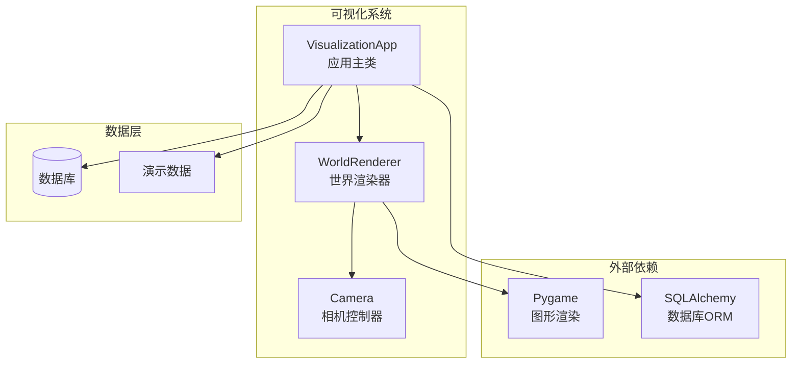
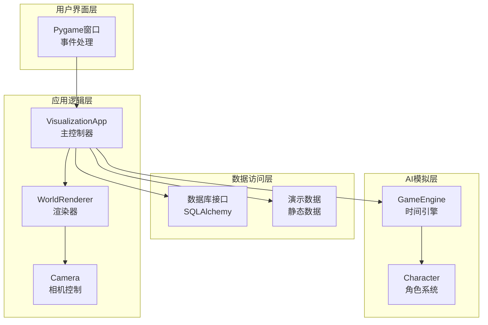
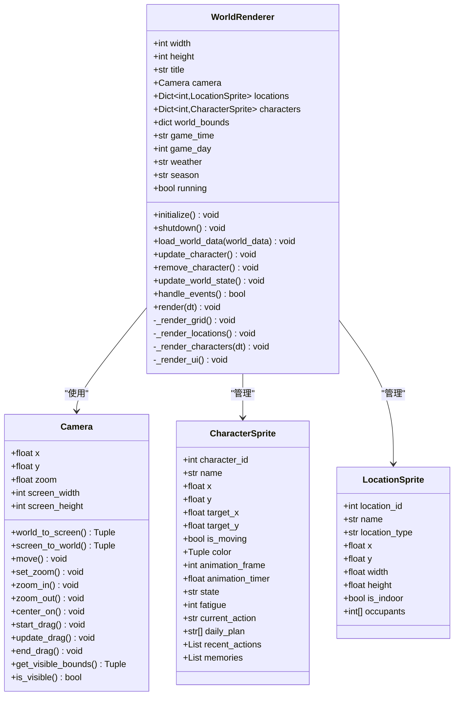
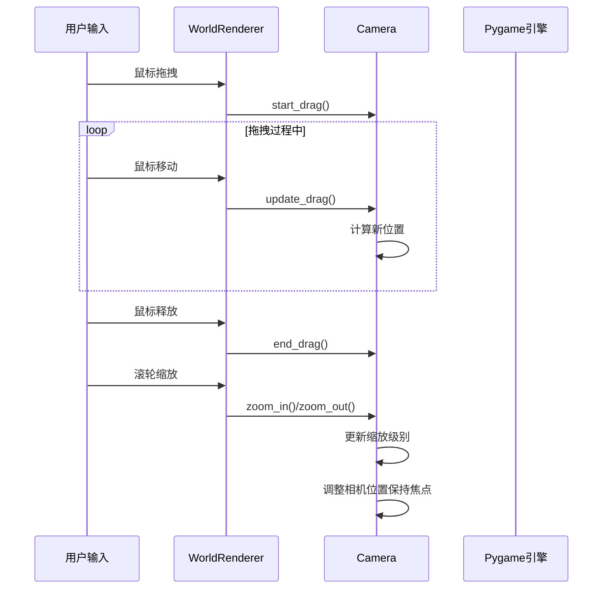
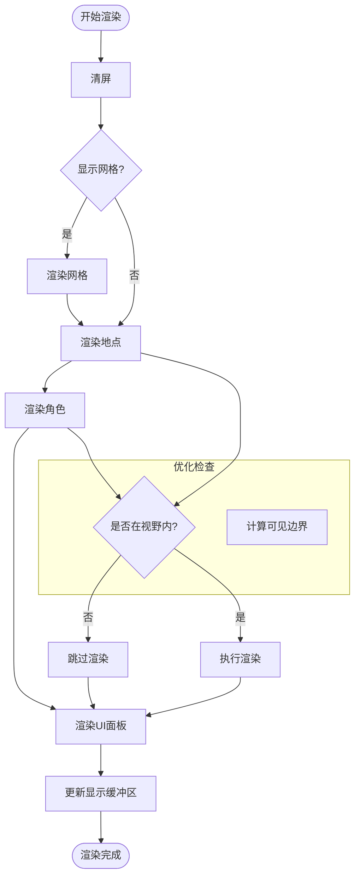
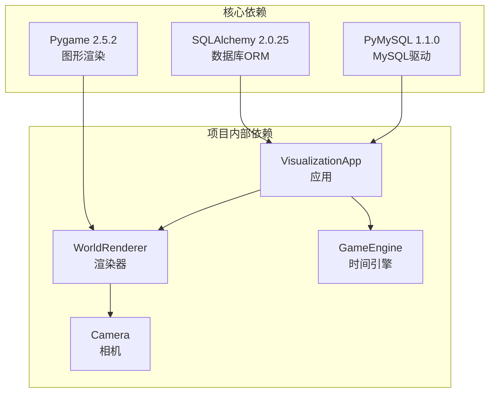
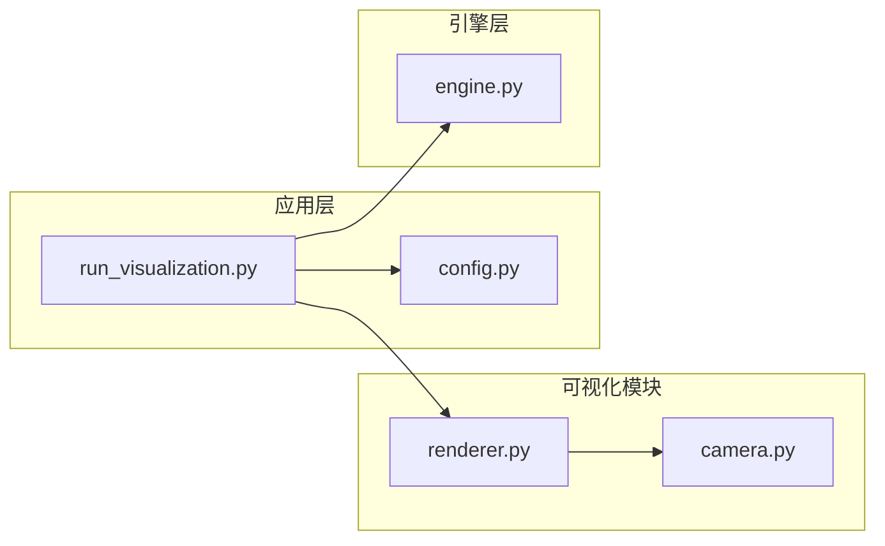

# 可视化展示系统

<cite>
**本文引用的文件**
- [renderer.py](file://core_engine/visualization/renderer.py)
- [camera.py](file://core_engine/visualization/camera.py)
- [run_visualization.py](file://run_visualization.py)
- [engine.py](file://core_engine/engine.py)
- [config.py](file://shared/config.py)
- [requirements.txt](file://requirements.txt)
- [README.md](file://README.md)
</cite>

## 目录
1. [简介](#简介)
2. [项目结构](#项目结构)
3. [核心组件](#核心组件)
4. [架构概览](#架构概览)
5. [详细组件分析](#详细组件分析)
6. [依赖关系分析](#依赖关系分析)
7. [性能考虑](#性能考虑)
8. [故障排除指南](#故障排除指南)
9. [结论](#结论)
10. [附录](#附录)

## 简介

可视化展示系统是AI社区项目的核心组成部分，负责将AI角色在2D世界中的活动实时呈现给用户。该系统采用Pygame图形渲染引擎，结合智能相机控制系统，实现了流畅的交互式可视化体验。

系统的主要功能包括：
- **2D图形渲染**：使用Pygame绘制地图、地点和AI角色
- **相机控制系统**：支持平移、缩放、拖拽等视图操作
- **实时更新机制**：动态响应AI角色的位置变化和状态更新
- **交互式界面**：提供键盘和鼠标操作支持
- **调试和监控**：内置调试信息显示和性能监控

## 项目结构

可视化系统位于`core_engine/visualization/`目录下，采用模块化设计：



**图表来源**
- [renderer.py](file://core_engine/visualization/renderer.py#L106-L170)
- [camera.py](file://core_engine/visualization/camera.py#L11-L40)
- [run_visualization.py](file://run_visualization.py#L208-L230)

**章节来源**
- [renderer.py](file://core_engine/visualization/renderer.py#L1-L100)
- [camera.py](file://core_engine/visualization/camera.py#L1-L50)
- [run_visualization.py](file://run_visualization.py#L1-L50)

## 核心组件

### WorldRenderer（世界渲染器）

WorldRenderer是可视化系统的核心组件，负责管理整个渲染过程：

- **Pygame集成**：初始化和管理Pygame显示、字体和时钟
- **数据管理**：维护地点和角色的数据结构
- **渲染管线**：协调各个渲染阶段的执行顺序
- **事件处理**：响应用户输入并更新系统状态

### Camera（相机控制器）

Camera模块提供了完整的视图控制功能：

- **坐标转换**：世界坐标与屏幕坐标的双向转换
- **视图变换**：支持平移、缩放和拖拽操作
- **可视区域检测**：优化渲染性能，只绘制可见对象
- **边界限制**：防止视图超出合理范围

### VisualizationApp（应用主类）

VisualizationApp作为系统的入口点，负责：

- **数据加载**：从数据库或演示数据源获取初始状态
- **主循环控制**：协调渲染、事件处理和数据更新
- **模拟集成**：与AI模拟器协同工作
- **用户交互**：处理键盘和鼠标输入

**章节来源**
- [renderer.py](file://core_engine/visualization/renderer.py#L106-L170)
- [camera.py](file://core_engine/visualization/camera.py#L11-L40)
- [run_visualization.py](file://run_visualization.py#L208-L230)

## 架构概览

可视化系统采用分层架构设计，各层职责明确：



**图表来源**
- [run_visualization.py](file://run_visualization.py#L208-L230)
- [renderer.py](file://core_engine/visualization/renderer.py#L106-L170)
- [engine.py](file://core_engine/engine.py#L167-L200)

## 详细组件分析

### WorldRenderer 类结构



**图表来源**
- [renderer.py](file://core_engine/visualization/renderer.py#L106-L170)
- [camera.py](file://core_engine/visualization/camera.py#L11-L40)

### 相机控制系统

相机系统提供了完整的视图控制功能：



**图表来源**
- [camera.py](file://core_engine/visualization/camera.py#L97-L115)
- [renderer.py](file://core_engine/visualization/renderer.py#L375-L392)

### 渲染流程

渲染系统采用分层渲染策略：



**图表来源**
- [renderer.py](file://core_engine/visualization/renderer.py#L453-L481)
- [camera.py](file://core_engine/visualization/camera.py#L117-L140)

**章节来源**
- [renderer.py](file://core_engine/visualization/renderer.py#L106-L481)
- [camera.py](file://core_engine/visualization/camera.py#L11-L140)

### 事件处理机制

系统支持多种用户交互：

| 事件类型 | 操作 | 功能 |
|---------|------|------|
| 鼠标按下 | 左键 | 选择角色/地点 |
| 鼠标按下 | 中键 | 开始拖拽地图 |
| 鼠标滚动 | 上/下 | 放大/缩小 |
| 鼠标释放 | 中键 | 结束拖拽 |
| 鼠标移动 | 任意 | 更新悬停状态 |
| 键盘按下 | G | 切换网格显示 |
| 键盘按下 | L | 切换标签显示 |
| 键盘按下 | I | 切换角色详情 |
| 键盘按下 | D | 切换调试信息 |
| 键盘按下 | R | 重置视图 |
| 键盘按下 | ESC | 取消选择 |

**章节来源**
- [renderer.py](file://core_engine/visualization/renderer.py#L357-L452)

## 依赖关系分析

### 外部依赖

可视化系统主要依赖以下外部库：



**图表来源**
- [requirements.txt](file://requirements.txt#L1-L32)
- [run_visualization.py](file://run_visualization.py#L17-L26)

### 内部模块依赖



**图表来源**
- [run_visualization.py](file://run_visualization.py#L24-L26)
- [renderer.py](file://core_engine/visualization/renderer.py#L13)
- [engine.py](file://core_engine/engine.py#L14-L16)

**章节来源**
- [requirements.txt](file://requirements.txt#L1-L32)
- [run_visualization.py](file://run_visualization.py#L17-L26)

## 性能考虑

### 渲染优化

系统采用了多项性能优化措施：

1. **可见性检测**：使用`is_visible()`方法避免渲染不可见对象
2. **延迟加载**：仅在需要时加载字体和纹理资源
3. **批量更新**：合并相似的UI更新操作
4. **内存管理**：及时清理不再使用的Surface对象

### 相机优化

- **坐标缓存**：避免重复计算世界坐标到屏幕坐标的转换
- **缩放限制**：防止过度缩放导致的性能问题
- **拖拽优化**：使用增量更新而非全量重绘

### 数据结构优化

- **字典查找**：使用字典而非列表进行角色和地点的快速查找
- **数据类**：利用Python数据类减少样板代码
- **枚举类型**：使用枚举确保状态值的有效性

## 故障排除指南

### 常见问题及解决方案

#### Pygame初始化失败
**症状**：程序启动时报错，无法创建窗口
**原因**：缺少必要的图形驱动或权限不足
**解决方案**：
1. 确认系统已安装适当的图形驱动
2. 以管理员权限运行程序
3. 检查防火墙设置

#### 数据库连接问题
**症状**：无法从数据库加载地点和角色数据
**原因**：数据库配置错误或服务未启动
**解决方案**：
1. 检查`.env`文件中的数据库配置
2. 确认MySQL服务正在运行
3. 验证用户名和密码正确性

#### 字体加载失败
**症状**：UI文本显示异常或缺失
**原因**：系统字体文件不存在
**解决方案**：
1. 确认系统中存在微软雅黑字体
2. 检查字体文件路径
3. 程序会自动降级到默认字体

#### 性能问题
**症状**：渲染帧率低或卡顿
**原因**：对象过多或渲染复杂度过高
**解决方案**：
1. 减少同时显示的角色数量
2. 关闭不必要的UI元素
3. 调整相机缩放级别

**章节来源**
- [run_visualization.py](file://run_visualization.py#L17-L26)
- [renderer.py](file://core_engine/visualization/renderer.py#L182-L196)

## 结论

可视化展示系统成功实现了AI角色在2D世界中的实时可视化展示。通过精心设计的架构和优化的渲染管道，系统能够在保证交互流畅性的同时，准确反映AI角色的行为变化。

系统的主要优势包括：
- **模块化设计**：清晰的职责分离便于维护和扩展
- **性能优化**：有效的渲染优化确保良好的用户体验
- **交互友好**：直观的操作界面降低使用门槛
- **可扩展性**：灵活的架构支持功能扩展和定制

未来可以考虑的功能增强：
- 添加天气效果和昼夜循环
- 实现更丰富的角色动画
- 增加多分辨率支持
- 优化大数据集的渲染性能

## 附录

### 启动和配置

系统支持两种运行模式：
1. **数据库模式**：从真实数据库加载数据
2. **演示模式**：使用内置演示数据

启动命令：
```bash
python run_visualization.py [--demo]
```

### 配置选项

| 参数 | 默认值 | 描述 |
|------|--------|------|
| 窗口宽度 | 1280px | Pygame窗口宽度 |
| 窗口高度 | 720px | Pygame窗口高度 |
| 数据刷新间隔 | 5秒 | 数据更新频率 |
| 相机缩放范围 | 0.2-3.0 | 最小/最大缩放级别 |
| 网格间距 | 50单位 | 地图网格显示间距 |

### 开发指南

#### 添加新的渲染元素
1. 在`WorldRenderer`中添加相应的数据结构
2. 实现对应的渲染方法
3. 在`render()`方法中调用新方法
4. 添加必要的事件处理逻辑

#### 自定义相机行为
1. 修改`Camera`类的方法
2. 更新坐标转换逻辑
3. 调整边界检测算法
4. 测试各种缩放级别的表现

#### 扩展UI功能
1. 设计新的UI面板布局
2. 实现相应的渲染逻辑
3. 添加键盘快捷键支持
4. 测试不同分辨率下的显示效果