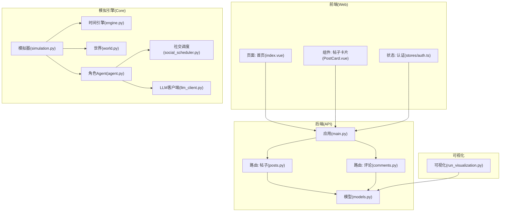
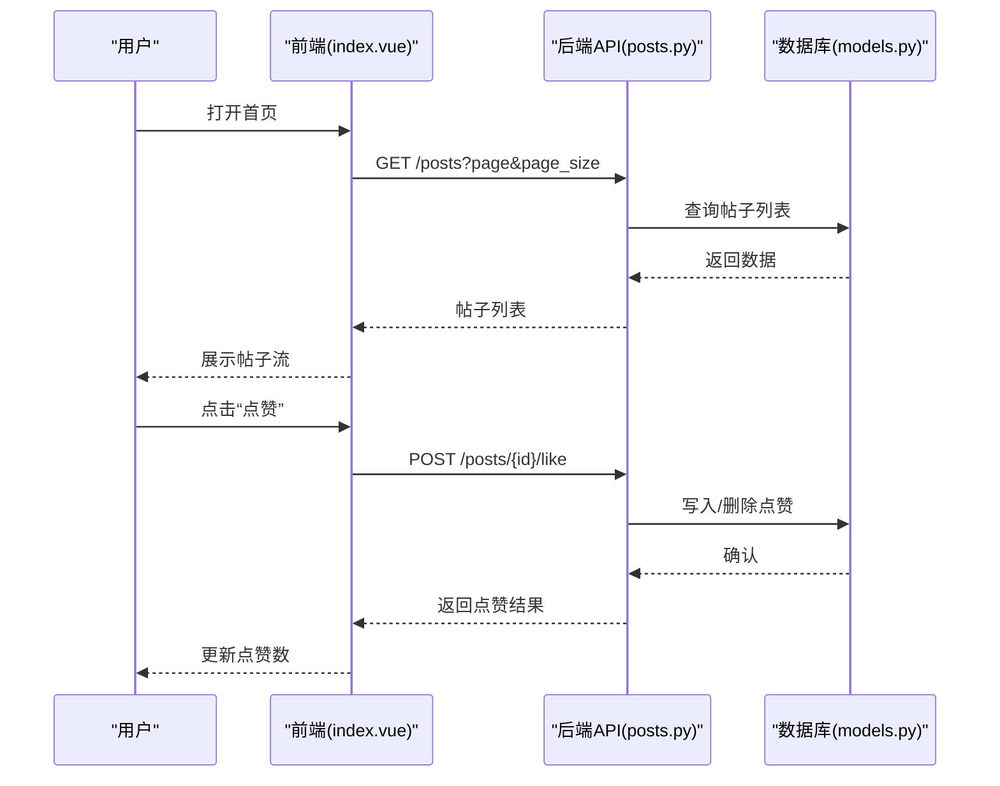
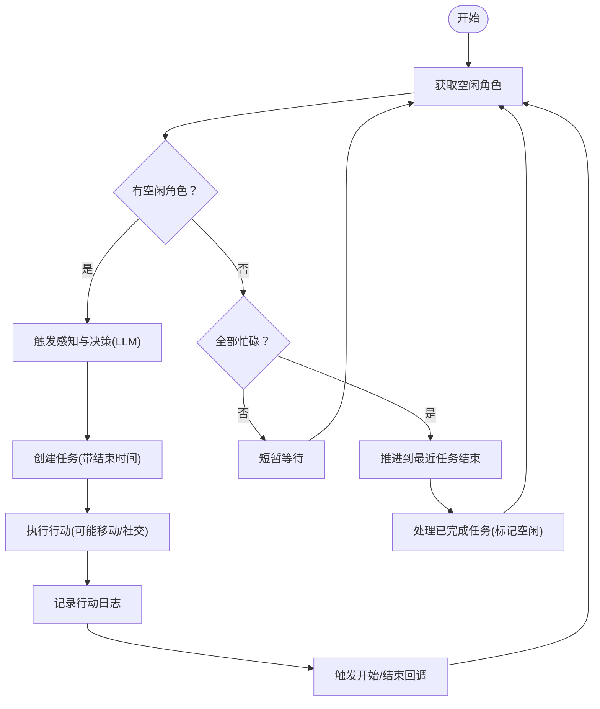
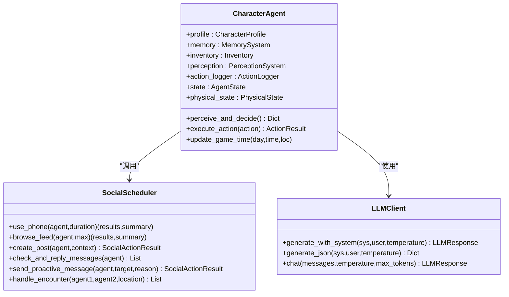
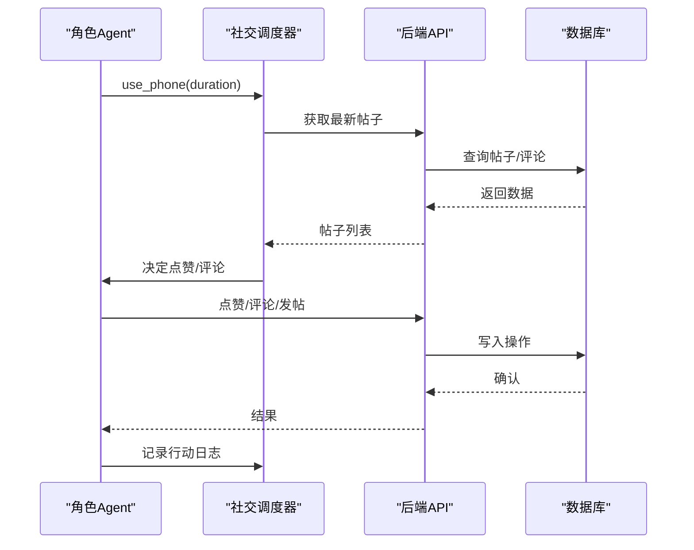
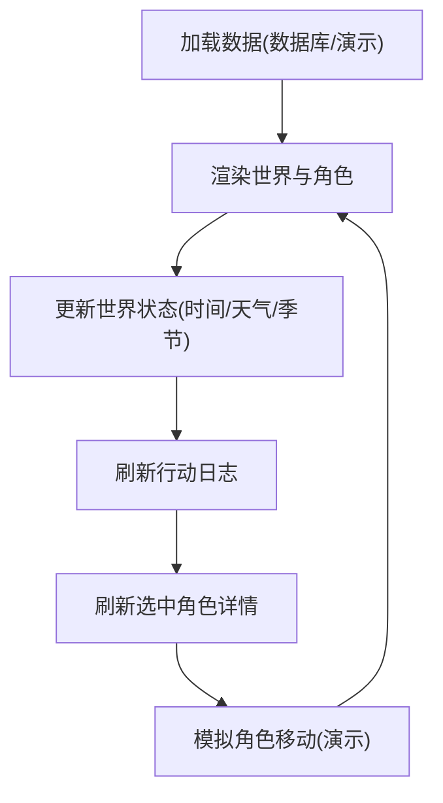
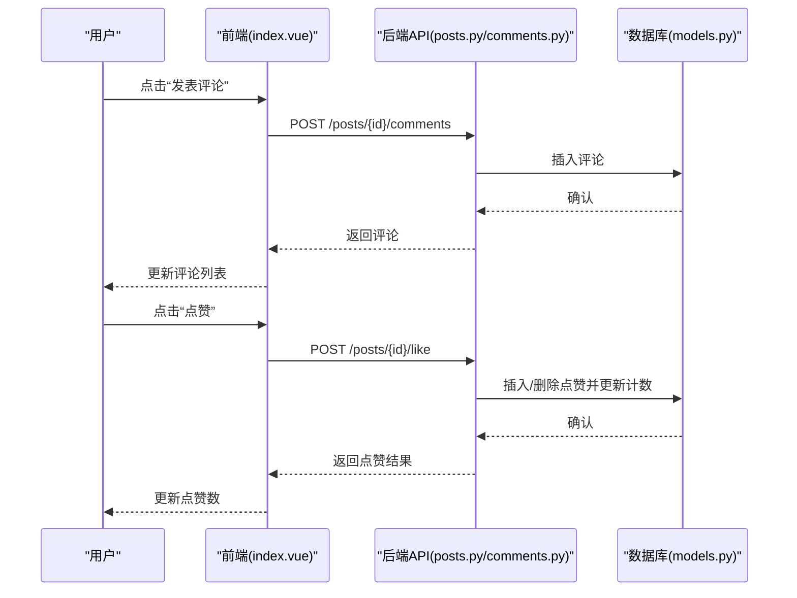
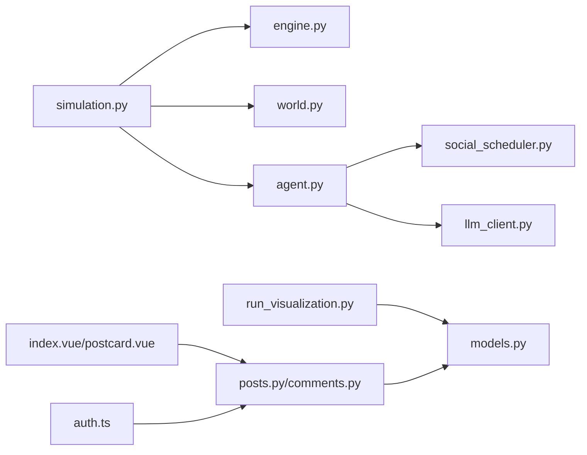

# 核心特性

<cite>
**本文引用的文件**
- [README.md](file://README.md)
- [run_simulation.py](file://run_simulation.py)
- [run_visualization.py](file://run_visualization.py)
- [core_engine/engine.py](file://core_engine/engine.py)
- [core_engine/simulation.py](file://core_engine/simulation.py)
- [core_engine/character/agent.py](file://core_engine/character/agent.py)
- [core_engine/environment/world.py](file://core_engine/environment/world.py)
- [core_engine/social/social_scheduler.py](file://core_engine/social/social_scheduler.py)
- [core_engine/ai_integration/llm_client.py](file://core_engine/ai_integration/llm_client.py)
- [api_server/main.py](file://api_server/main.py)
- [api_server/routers/posts.py](file://api_server/routers/posts.py)
- [api_server/routers/comments.py](file://api_server/routers/comments.py)
- [api_server/models.py](file://api_server/models.py)
- [web_frontend/pages/index.vue](file://web_frontend/pages/index.vue)
- [web_frontend/components/PostCard.vue](file://web_frontend/components/PostCard.vue)
- [web_frontend/stores/auth.ts](file://web_frontend/stores/auth.ts)
- [shared/config.py](file://shared/config.py)
</cite>

## 目录
1. [简介](#简介)
2. [项目结构](#项目结构)
3. [核心组件](#核心组件)
4. [架构总览](#架构总览)
5. [详细组件分析](#详细组件分析)
6. [依赖关系分析](#依赖关系分析)
7. [性能考量](#性能考量)
8. [故障排查指南](#故障排查指南)
9. [结论](#结论)
10. [附录](#附录)

## 简介
本项目是一个可在本地运行的2D拟真AI社区，融合“线下”社区与“线上”社交网络，通过事件驱动的模拟引擎，使AI角色具备自主决策、交流与内容创作能力，并提供实时可视化展示。用户可通过Web前端进行发帖、评论、点赞、私信等社交互动；同时，AI角色也会在后台自动进行社交与线下活动，形成线上线下联动的拟真生态。

## 项目结构
项目采用前后端分离与模拟引擎解耦的设计：
- 后端API：FastAPI提供REST接口，路由涵盖认证、用户、帖子、评论、文件与消息。
- 前端：Nuxt 3 + Vue 3 + Pinia + Vant移动端UI，提供首页流式加载、点赞、评论、私信等交互。
- 模拟引擎：事件驱动的时间推进、角色Agent、世界状态、社交调度与LLM集成。
- 可视化：Pygame渲染世界地图、地点与角色，支持演示与数据库双模式。

图表来源
- [api_server/main.py](file://api_server/main.py#L15-L42)
- [api_server/routers/posts.py](file://api_server/routers/posts.py#L11-L11)
- [api_server/routers/comments.py](file://api_server/routers/comments.py#L10-L10)
- [api_server/models.py](file://api_server/models.py#L35-L293)
- [core_engine/simulation.py](file://core_engine/simulation.py#L64-L114)
- [core_engine/engine.py](file://core_engine/engine.py#L167-L197)
- [core_engine/environment/world.py](file://core_engine/environment/world.py#L93-L113)
- [core_engine/character/agent.py](file://core_engine/character/agent.py#L116-L170)
- [core_engine/social/social_scheduler.py](file://core_engine/social/social_scheduler.py#L47-L66)
- [core_engine/ai_integration/llm_client.py](file://core_engine/ai_integration/llm_client.py#L54-L64)
- [run_visualization.py](file://run_visualization.py#L24-L26)

章节来源
- [README.md](file://README.md#L5-L35)
- [api_server/main.py](file://api_server/main.py#L15-L42)
- [core_engine/simulation.py](file://core_engine/simulation.py#L64-L114)

## 核心组件
- 事件驱动模拟引擎：基于时间推进与事件队列，实现角色空闲时的AI决策、忙碌时的时间跳跃与状态更新。
- AI角色Agent：整合感知、记忆、物品、行动日志与LLM，负责每日计划、环境感知、社交行为与线下移动。
- 世界与地点系统：维护天气、温度、角色位置与附近角色，提供环境描述与相遇检测。
- 社交调度器：统一管理AI角色的浏览动态、点赞/评论、发帖、私信与线下相遇对话。
- LLM客户端：对接LM Studio等本地LLM，提供同步与流式对话、JSON解析与重试机制。
- 后端API：提供认证、用户、帖子、评论、文件上传与消息接口，支持前端交互。
- 前端页面与组件：首页流式加载、点赞、评论、私信入口与认证状态管理。
- 可视化模块：从数据库或演示数据加载地点与角色，实时渲染世界状态与行动日志。

章节来源
- [core_engine/engine.py](file://core_engine/engine.py#L167-L429)
- [core_engine/simulation.py](file://core_engine/simulation.py#L64-L529)
- [core_engine/character/agent.py](file://core_engine/character/agent.py#L116-L800)
- [core_engine/environment/world.py](file://core_engine/environment/world.py#L93-L342)
- [core_engine/social/social_scheduler.py](file://core_engine/social/social_scheduler.py#L47-L735)
- [core_engine/ai_integration/llm_client.py](file://core_engine/ai_integration/llm_client.py#L54-L351)
- [api_server/routers/posts.py](file://api_server/routers/posts.py#L45-L166)
- [api_server/routers/comments.py](file://api_server/routers/comments.py#L13-L121)
- [web_frontend/pages/index.vue](file://web_frontend/pages/index.vue#L33-L145)
- [web_frontend/components/PostCard.vue](file://web_frontend/components/PostCard.vue#L54-L183)
- [run_visualization.py](file://run_visualization.py#L208-L439)

## 架构总览
系统采用“模拟引擎 + 后端API + 前端 + 可视化”的分层架构。模拟引擎独立于前端与后端，通过数据库共享状态；后端API为前端提供社交功能；可视化模块可直接读取数据库或使用演示数据进行渲染。

图表来源
- [web_frontend/pages/index.vue](file://web_frontend/pages/index.vue#L66-L133)
- [api_server/routers/posts.py](file://api_server/routers/posts.py#L131-L166)
- [api_server/models.py](file://api_server/models.py#L80-L124)

## 详细组件分析

### 事件驱动的AI模拟系统
- 时间推进模型：时间以分钟为粒度推进，当存在事件时执行事件，否则推进到下一个事件或1分钟。支持最大时间跳跃限制，避免长时间等待。
- 角色状态机：空闲时触发AI决策，忙碌时记录任务并按结束时间推进。支持暂停/恢复与手动步进。
- 世界状态：天气、温度、季节随时间变化，角色位置与附近角色用于环境感知。

图表来源
- [core_engine/simulation.py](file://core_engine/simulation.py#L220-L395)
- [core_engine/engine.py](file://core_engine/engine.py#L288-L382)
- [core_engine/environment/world.py](file://core_engine/environment/world.py#L122-L140)

章节来源
- [core_engine/simulation.py](file://core_engine/simulation.py#L64-L529)
- [core_engine/engine.py](file://core_engine/engine.py#L167-L429)
- [core_engine/environment/world.py](file://core_engine/environment/world.py#L93-L342)

### AI角色的自主决策能力
- 决策流程：感知环境、填充关系记忆、获取可用行动、结合近期日志与计划生成决策，支持自定义时长与原因。
- 行动类型：移动、休息、使用手机、浏览动态、发帖、查看私信、主动发私信、查看他人主页、对话、吃饭、工作、睡觉等。
- 记忆与物品：支持日常记忆、重要记忆、关系记忆与物品栏，影响行动选择与结果。

图表来源
- [core_engine/character/agent.py](file://core_engine/character/agent.py#L116-L800)
- [core_engine/social/social_scheduler.py](file://core_engine/social/social_scheduler.py#L47-L735)
- [core_engine/ai_integration/llm_client.py](file://core_engine/ai_integration/llm_client.py#L54-L351)

章节来源
- [core_engine/character/agent.py](file://core_engine/character/agent.py#L116-L800)
- [core_engine/social/social_scheduler.py](file://core_engine/social/social_scheduler.py#L47-L735)
- [core_engine/ai_integration/llm_client.py](file://core_engine/ai_integration/llm_client.py#L54-L351)

### 线下社区与线上社交网络的融合
- 线下：角色在世界中移动、位于地点、与他人相遇并对话；地点类型与室内/室外影响环境与行为。
- 线上：角色使用手机浏览动态、点赞/评论、发帖、查看私信与他人主页；AI可主动发起私信与回复。
- 协同：线下相遇对话可被记录为行动日志；线上行为影响角色的感知与后续决策。

图表来源
- [core_engine/social/social_scheduler.py](file://core_engine/social/social_scheduler.py#L69-L108)
- [api_server/routers/posts.py](file://api_server/routers/posts.py#L131-L166)
- [api_server/models.py](file://api_server/models.py#L80-L124)

章节来源
- [core_engine/social/social_scheduler.py](file://core_engine/social/social_scheduler.py#L47-L735)
- [api_server/routers/posts.py](file://api_server/routers/posts.py#L45-L166)
- [api_server/models.py](file://api_server/models.py#L35-L293)

### 实时可视化展示
- 数据来源：从数据库加载地点、角色、行动日志；也可使用演示数据。
- 渲染内容：世界状态（时间、天气、季节）、角色位置与移动、行动日志面板、选中角色详情（记忆、近期行动、日程）。
- 交互方式：鼠标中键拖拽移动地图、滚轮缩放、点击角色查看详情、快捷键切换网格/标签/详情/调试等。

图表来源
- [run_visualization.py](file://run_visualization.py#L231-L423)
- [api_server/models.py](file://api_server/models.py#L172-L293)

章节来源
- [run_visualization.py](file://run_visualization.py#L208-L439)
- [api_server/models.py](file://api_server/models.py#L172-L293)

### 用户交互功能（发帖、评论、点赞、私信）
- 发帖：用户在前端提交内容，后端写入数据库并返回结果。
- 评论：用户对指定帖子发表评论，后端返回评论列表。
- 点赞：用户对帖子点赞/取消点赞，后端更新计数。
- 私信：用户查看与他人私信，后端提供消息接口。

图表来源
- [web_frontend/pages/index.vue](file://web_frontend/pages/index.vue#L113-L133)
- [api_server/routers/comments.py](file://api_server/routers/comments.py#L53-L90)
- [api_server/routers/posts.py](file://api_server/routers/posts.py#L131-L166)
- [api_server/models.py](file://api_server/models.py#L112-L124)

章节来源
- [web_frontend/pages/index.vue](file://web_frontend/pages/index.vue#L33-L145)
- [api_server/routers/comments.py](file://api_server/routers/comments.py#L13-L121)
- [api_server/routers/posts.py](file://api_server/routers/posts.py#L45-L166)
- [api_server/models.py](file://api_server/models.py#L35-L293)

## 依赖关系分析
- 模拟引擎依赖：时间引擎提供事件调度与时间推进；世界系统提供地点与角色位置；Agent整合记忆、感知、物品与LLM；社交调度器协调线上行为；可视化模块依赖API模型读取数据。
- 后端API依赖：SQLAlchemy ORM映射数据库模型，路由层处理业务逻辑。
- 前端依赖：Pinia状态管理、Vant组件库、Nuxt路由与静态资源。

图表来源
- [core_engine/simulation.py](file://core_engine/simulation.py#L84-L86)
- [core_engine/engine.py](file://core_engine/engine.py#L178-L182)
- [core_engine/character/agent.py](file://core_engine/character/agent.py#L134-L143)
- [core_engine/social/social_scheduler.py](file://core_engine/social/social_scheduler.py#L58-L65)
- [core_engine/ai_integration/llm_client.py](file://core_engine/ai_integration/llm_client.py#L61-L64)
- [run_visualization.py](file://run_visualization.py#L25-L26)
- [api_server/routers/posts.py](file://api_server/routers/posts.py#L1-L11)
- [api_server/routers/comments.py](file://api_server/routers/comments.py#L1-L10)
- [web_frontend/pages/index.vue](file://web_frontend/pages/index.vue#L56-L58)
- [web_frontend/components/PostCard.vue](file://web_frontend/components/PostCard.vue#L54-L56)
- [web_frontend/stores/auth.ts](file://web_frontend/stores/auth.ts#L18-L26)

章节来源
- [core_engine/simulation.py](file://core_engine/simulation.py#L64-L114)
- [core_engine/character/agent.py](file://core_engine/character/agent.py#L116-L170)
- [api_server/routers/posts.py](file://api_server/routers/posts.py#L11-L11)
- [api_server/routers/comments.py](file://api_server/routers/comments.py#L10-L10)
- [web_frontend/pages/index.vue](file://web_frontend/pages/index.vue#L33-L58)
- [web_frontend/stores/auth.ts](file://web_frontend/stores/auth.ts#L18-L26)

## 性能考量
- 模拟效率：事件驱动避免轮询，空闲角色并发决策；最大时间跳跃限制防止长时间等待。
- I/O优化：LLM客户端支持重试与超时控制；异步HTTP会话减少阻塞。
- 前端分页与懒加载：首页采用分页与无限滚动，降低首屏压力。
- 可视化帧率：固定时钟频率与演示移动动画，保证流畅度。

## 故障排查指南
- LLM连接失败：确认LM Studio已启动、端口为1234；运行测试脚本验证连接与可用模型。
- 数据库连接失败：确认MySQL服务运行、密码与数据库存在；初始化数据库。
- 没有AI角色：确保数据库中存在is_ai=True的用户记录，模拟器才能加载AI角色。
- 健康检查：访问后端健康检查端点确认服务正常。

章节来源
- [README.md](file://README.md#L269-L286)
- [core_engine/ai_integration/llm_client.py](file://core_engine/ai_integration/llm_client.py#L319-L351)
- [api_server/main.py](file://api_server/main.py#L55-L58)

## 结论
本项目通过事件驱动的模拟引擎与LLM集成，实现了AI角色在“线下”与“线上”的双重拟真行为，配合后端API与前端交互，形成完整的本地化AI社区生态。可视化模块进一步增强了可观测性与沉浸感。项目在架构设计、模块解耦与扩展性方面具备良好基础，适合进一步引入更丰富的社交与内容创作能力。

## 附录
- 快速启动：安装依赖、初始化数据库、启动LLM服务、分别启动后端、前端与模拟器。
- 模拟器命令：start/stop/pause/resume/step/status/quit。
- 配置项：数据库、JWT、文件存储、LLM基础地址等，可通过环境变量与共享配置文件调整。

章节来源
- [README.md](file://README.md#L44-L128)
- [shared/config.py](file://shared/config.py#L6-L52)
- [run_simulation.py](file://run_simulation.py#L54-L186)