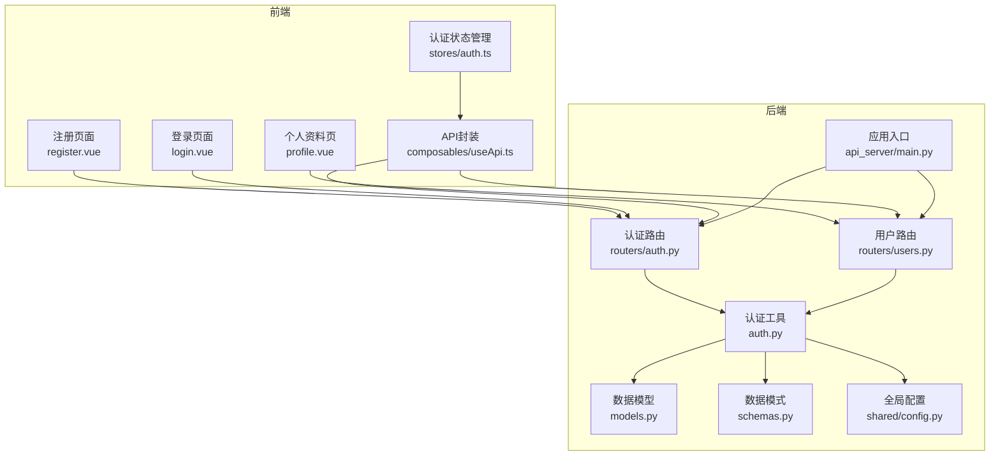
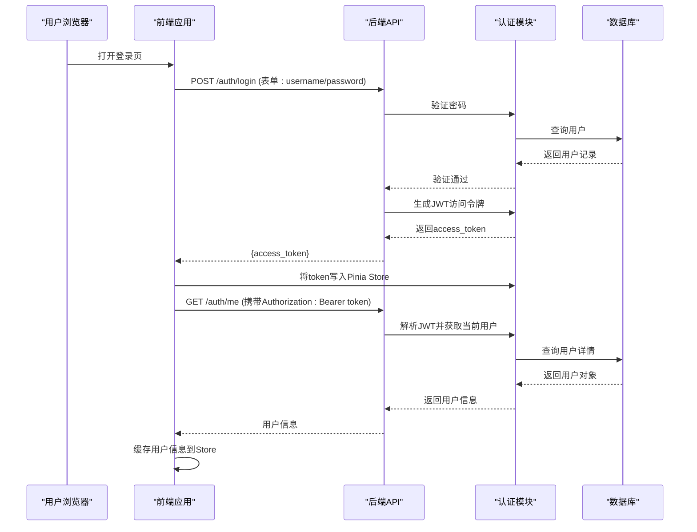
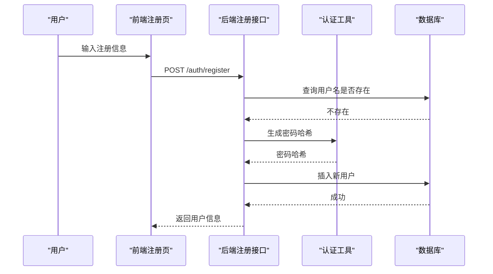
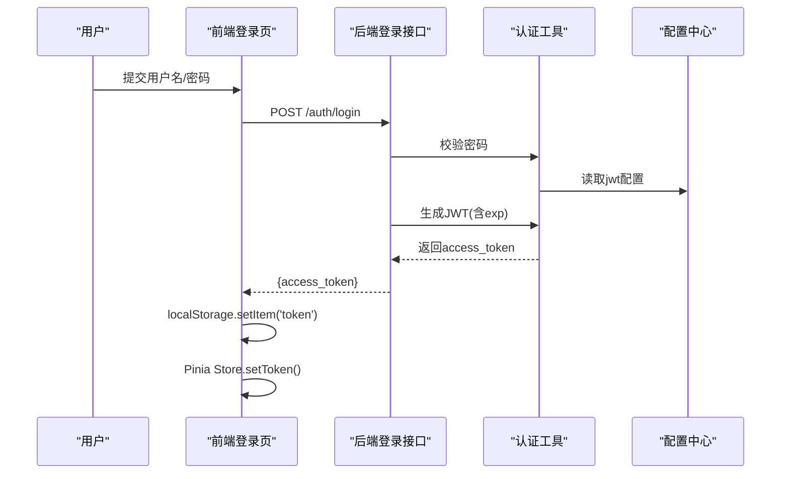
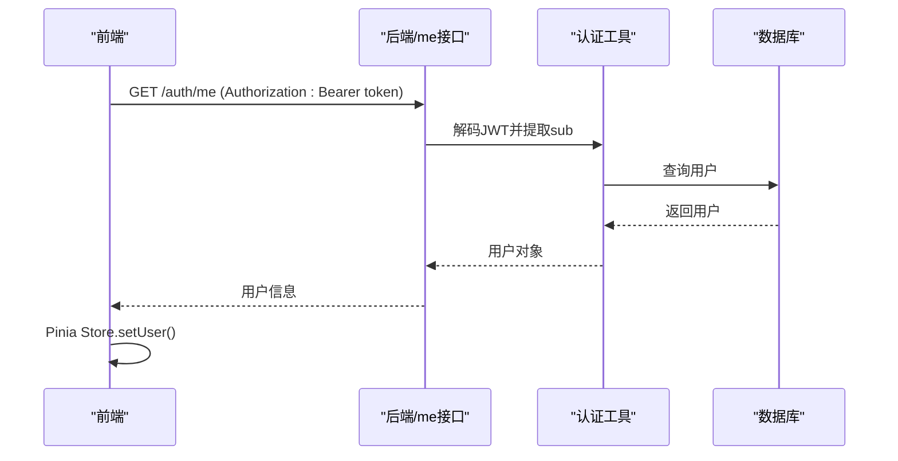
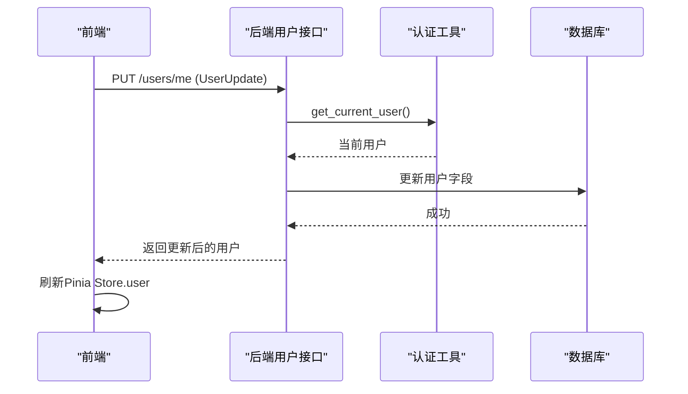
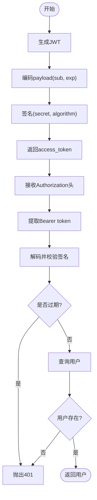
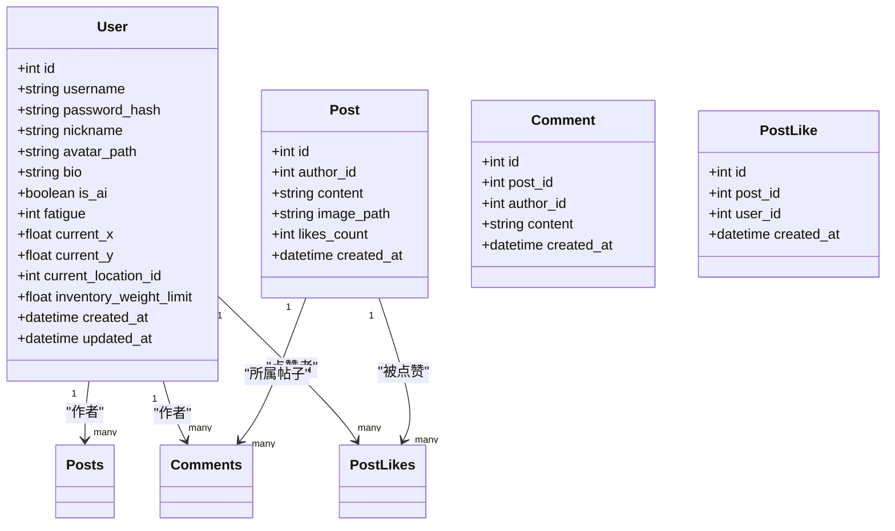
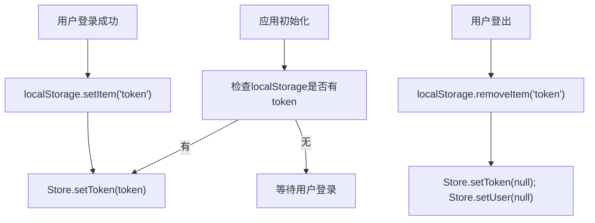
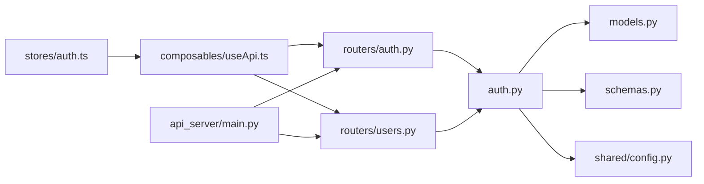

# 用户管理系统

<cite>
**本文档引用的文件**
- [api_server/main.py](file://api_server/main.py)
- [api_server/auth.py](file://api_server/auth.py)
- [api_server/models.py](file://api_server/models.py)
- [api_server/schemas.py](file://api_server/schemas.py)
- [api_server/routers/auth.py](file://api_server/routers/auth.py)
- [api_server/routers/users.py](file://api_server/routers/users.py)
- [shared/config.py](file://shared/config.py)
- [web_frontend/stores/auth.ts](file://web_frontend/stores/auth.ts)
- [web_frontend/pages/register.vue](file://web_frontend/pages/register.vue)
- [web_frontend/pages/login.vue](file://web_frontend/pages/login.vue)
- [web_frontend/pages/profile.vue](file://web_frontend/pages/profile.vue)
- [web_frontend/composables/useApi.ts](file://web_frontend/composables/useApi.ts)
- [README.md](file://README.md)
</cite>

## 目录
1. [简介](#简介)
2. [项目结构](#项目结构)
3. [核心组件](#核心组件)
4. [架构总览](#架构总览)
5. [详细组件分析](#详细组件分析)
6. [依赖关系分析](#依赖关系分析)
7. [性能考虑](#性能考虑)
8. [故障排除指南](#故障排除指南)
9. [结论](#结论)

## 简介
本文件为用户管理系统提供完整的技术文档，涵盖用户注册、登录、个人信息管理等核心功能；深入解析JWT认证机制的实现原理（令牌生成、验证、过期策略）；阐述用户数据模型设计（字段定义、数据验证、权限控制）；介绍前端状态管理中的认证状态维护（Token持久化、用户信息缓存）；并提供最佳实践与安全建议，帮助开发者构建可靠的用户身份认证系统。

## 项目结构
该系统采用前后端分离架构：
- 后端：基于FastAPI的REST API，使用SQLAlchemy进行数据库建模，Pydantic进行数据校验，JWT进行认证。
- 前端：基于Nuxt 3 + Vue 3 + Pinia的状态管理，通过自定义API封装统一处理鉴权头与错误处理。

**图表来源**
- [api_server/main.py](file://api_server/main.py#L15-L42)
- [api_server/routers/auth.py](file://api_server/routers/auth.py#L17-L17)
- [api_server/routers/users.py](file://api_server/routers/users.py#L10-L10)
- [api_server/auth.py](file://api_server/auth.py#L18-L18)
- [api_server/models.py](file://api_server/models.py#L35-L61)
- [api_server/schemas.py](file://api_server/schemas.py#L8-L26)
- [shared/config.py](file://shared/config.py#L6-L17)
- [web_frontend/stores/auth.ts](file://web_frontend/stores/auth.ts#L18-L79)
- [web_frontend/composables/useApi.ts](file://web_frontend/composables/useApi.ts#L8-L48)

**章节来源**
- [README.md](file://README.md#L1-L35)
- [api_server/main.py](file://api_server/main.py#L15-L42)

## 核心组件
- 认证路由与控制器：负责注册、登录、获取当前用户信息等接口。
- 认证工具：提供密码哈希、JWT生成与解码、当前用户解析等能力。
- 数据模型与模式：定义用户实体及序列化/反序列化规则。
- 前端状态管理：维护Token与用户信息，统一注入Authorization头。
- 全局配置：集中管理JWT密钥、算法、过期时间等参数。

**章节来源**
- [api_server/routers/auth.py](file://api_server/routers/auth.py#L20-L77)
- [api_server/auth.py](file://api_server/auth.py#L24-L88)
- [api_server/models.py](file://api_server/models.py#L35-L61)
- [api_server/schemas.py](file://api_server/schemas.py#L8-L53)
- [web_frontend/stores/auth.ts](file://web_frontend/stores/auth.ts#L18-L79)
- [shared/config.py](file://shared/config.py#L14-L17)

## 架构总览
系统采用OAuth2密码模式（表单提交），后端使用JWT作为访问令牌。认证流程如下：

**图表来源**
- [api_server/routers/auth.py](file://api_server/routers/auth.py#L45-L71)
- [api_server/auth.py](file://api_server/auth.py#L58-L74)
- [web_frontend/pages/login.vue](file://web_frontend/pages/login.vue#L68-L100)
- [web_frontend/stores/auth.ts](file://web_frontend/stores/auth.ts#L57-L77)

## 详细组件分析

### 用户注册流程
- 前端表单收集用户名、昵称、密码，进行基础校验。
- 调用后端注册接口，传入用户名、密码、昵称。
- 后端检查用户名唯一性，生成密码哈希并创建用户记录。
- 返回新用户信息（不含敏感字段）。

**图表来源**
- [web_frontend/pages/register.vue](file://web_frontend/pages/register.vue#L97-L113)
- [api_server/routers/auth.py](file://api_server/routers/auth.py#L20-L42)
- [api_server/auth.py](file://api_server/auth.py#L29-L31)

**章节来源**
- [web_frontend/pages/register.vue](file://web_frontend/pages/register.vue#L11-L52)
- [api_server/routers/auth.py](file://api_server/routers/auth.py#L20-L42)

### 用户登录与JWT认证
- 前端以表单方式提交用户名/密码至登录接口。
- 后端验证凭据，生成访问令牌（含过期时间）。
- 前端将令牌存入localStorage并写入Pinia Store。
- 后续请求通过拦截器自动附加Authorization头。

**图表来源**
- [web_frontend/pages/login.vue](file://web_frontend/pages/login.vue#L68-L91)
- [api_server/routers/auth.py](file://api_server/routers/auth.py#L45-L71)
- [api_server/auth.py](file://api_server/auth.py#L34-L43)
- [shared/config.py](file://shared/config.py#L14-L17)

**章节来源**
- [web_frontend/pages/login.vue](file://web_frontend/pages/login.vue#L68-L100)
- [api_server/routers/auth.py](file://api_server/routers/auth.py#L45-L71)
- [api_server/auth.py](file://api_server/auth.py#L34-L43)
- [shared/config.py](file://shared/config.py#L14-L17)

### 获取当前用户信息
- 前端从Store读取token，发起/me请求。
- 后端通过OAuth2方案解析Bearer Token，解码JWT获取用户ID。
- 查询数据库返回用户信息，前端缓存到Store。

**图表来源**
- [web_frontend/stores/auth.ts](file://web_frontend/stores/auth.ts#L57-L77)
- [api_server/routers/auth.py](file://api_server/routers/auth.py#L74-L77)
- [api_server/auth.py](file://api_server/auth.py#L46-L74)

**章节来源**
- [web_frontend/stores/auth.ts](file://web_frontend/stores/auth.ts#L57-L77)
- [api_server/routers/auth.py](file://api_server/routers/auth.py#L74-L77)

### 个人信息管理
- 更新当前用户信息：昵称、头像、个人简介等。
- 后端使用依赖注入的当前用户上下文，仅允许修改本人信息。
- 前端调用PUT /users/me，成功后刷新用户信息。

**图表来源**
- [api_server/routers/users.py](file://api_server/routers/users.py#L25-L41)
- [api_server/auth.py](file://api_server/auth.py#L58-L74)

**章节来源**
- [api_server/routers/users.py](file://api_server/routers/users.py#L25-L41)

### JWT认证机制详解
- 令牌生成：使用配置中心的密钥与算法，设置exp过期时间，编码sub（用户ID）。
- 令牌验证：OAuth2PasswordBearer自动从Authorization头提取Bearer token，解码并校验。
- 过期策略：默认24小时，可通过配置项调整。
- 可选用户解析：支持无强制认证的场景，返回None便于匿名访问。

**图表来源**
- [api_server/auth.py](file://api_server/auth.py#L34-L55)
- [shared/config.py](file://shared/config.py#L14-L17)

**章节来源**
- [api_server/auth.py](file://api_server/auth.py#L34-L55)
- [shared/config.py](file://shared/config.py#L14-L17)

### 用户数据模型设计
- 用户实体包含：主键、用户名（唯一索引）、密码哈希、昵称、头像路径、个人简介、是否AI角色、位置坐标、疲劳度、库存上限、时间戳等。
- 关系映射：用户与帖子、评论、点赞、记忆等存在一对多或唯一约束关系。
- 模型字段约束：长度限制、非空约束、索引优化（如username、is_ai）。

**图表来源**
- [api_server/models.py](file://api_server/models.py#L35-L61)
- [api_server/models.py](file://api_server/models.py#L80-L93)
- [api_server/models.py](file://api_server/models.py#L112-L123)
- [api_server/models.py](file://api_server/models.py#L96-L109)

**章节来源**
- [api_server/models.py](file://api_server/models.py#L35-L61)

### 前端状态管理与Token持久化
- Pinia Store维护token与user状态，提供isLoggedIn计算属性。
- 初始化时从localStorage恢复token；登出时清除token与用户信息。
- API封装自动在请求头注入Authorization，简化各页面调用。

**图表来源**
- [web_frontend/stores/auth.ts](file://web_frontend/stores/auth.ts#L48-L55)
- [web_frontend/stores/auth.ts](file://web_frontend/stores/auth.ts#L29-L46)

**章节来源**
- [web_frontend/stores/auth.ts](file://web_frontend/stores/auth.ts#L18-L79)
- [web_frontend/composables/useApi.ts](file://web_frontend/composables/useApi.ts#L8-L48)

## 依赖关系分析
- 后端路由依赖认证工具与数据库会话。
- 认证工具依赖配置中心与数据库模型。
- 前端Store依赖API封装，API封装依赖运行时配置与Store。

**图表来源**
- [api_server/main.py](file://api_server/main.py#L37-L42)
- [api_server/routers/auth.py](file://api_server/routers/auth.py#L1-L17)
- [api_server/routers/users.py](file://api_server/routers/users.py#L1-L10)
- [api_server/auth.py](file://api_server/auth.py#L13-L18)
- [shared/config.py](file://shared/config.py#L49-L51)
- [web_frontend/stores/auth.ts](file://web_frontend/stores/auth.ts#L1-L1)
- [web_frontend/composables/useApi.ts](file://web_frontend/composables/useApi.ts#L1-L1)

**章节来源**
- [api_server/main.py](file://api_server/main.py#L37-L42)
- [api_server/auth.py](file://api_server/auth.py#L13-L18)
- [shared/config.py](file://shared/config.py#L49-L51)

## 性能考虑
- 数据库索引：对高频查询字段（如用户名、AI标识）建立索引，减少查询成本。
- 分页与限制：后端对列表接口提供分页参数，避免一次性返回大量数据。
- 缓存策略：前端Store缓存用户信息，减少重复请求；localStorage持久化Token，提升用户体验。
- JWT过期：合理设置过期时间，平衡安全性与用户体验。

[本节为通用指导，无需特定文件引用]

## 故障排除指南
- 登录失败
  - 检查用户名/密码是否正确，确认后端密码哈希验证逻辑。
  - 确认前端使用表单格式提交，Content-Type为application/x-www-form-urlencoded。
- 401未授权
  - 确认请求头是否包含Authorization: Bearer token。
  - 检查JWT签名密钥与算法配置是否一致。
- 用户信息获取失败
  - 确认Token未过期且有效。
  - 检查后端get_current_user解析流程与数据库用户是否存在。
- 前端Token丢失
  - 检查localStorage中token是否存在，必要时重新登录。

**章节来源**
- [api_server/routers/auth.py](file://api_server/routers/auth.py#L45-L71)
- [api_server/auth.py](file://api_server/auth.py#L58-L74)
- [web_frontend/pages/login.vue](file://web_frontend/pages/login.vue#L68-L100)
- [web_frontend/stores/auth.ts](file://web_frontend/stores/auth.ts#L57-L77)

## 结论
本用户管理系统通过清晰的前后端职责划分与标准的OAuth2/JWT流程，实现了安全、可扩展的身份认证与用户管理能力。后端以FastAPI与SQLAlchemy为核心，配合Pydantic的数据验证与JWT认证；前端以Pinia进行状态管理，结合统一API封装，提供了良好的开发体验与用户体验。建议在生产环境中进一步完善令牌刷新、双因子认证、审计日志与更严格的输入校验，以满足更高安全等级的需求。