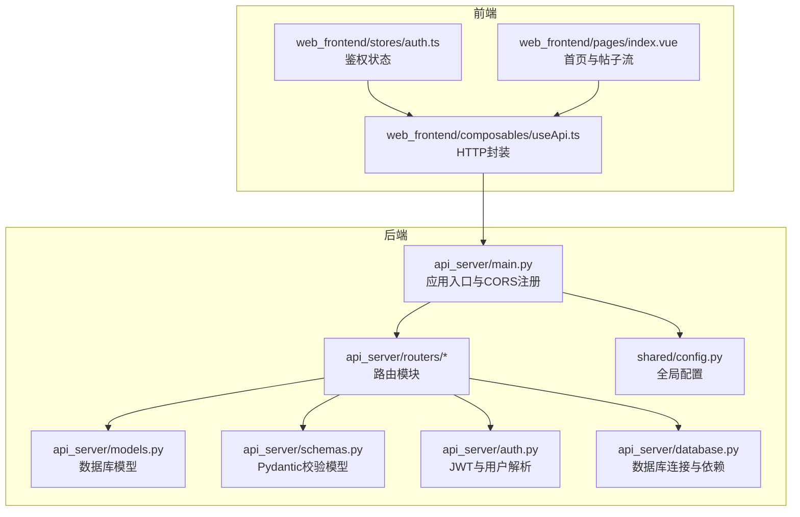
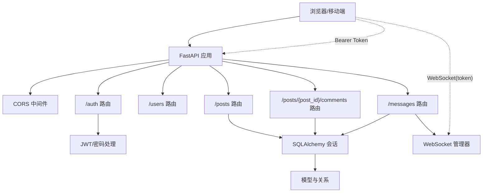
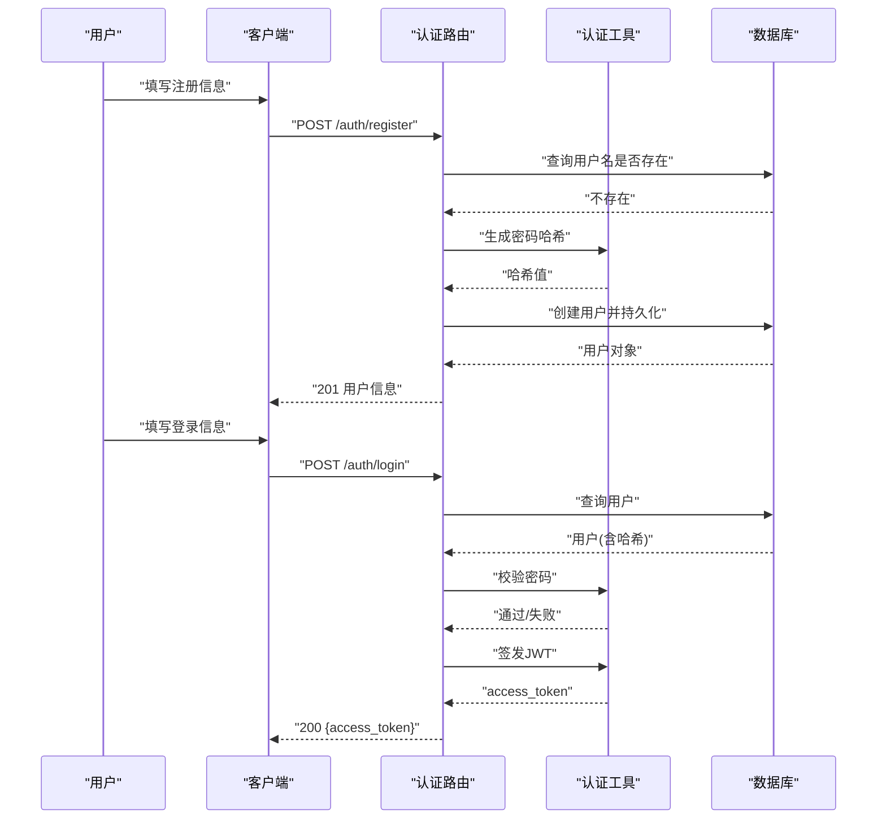
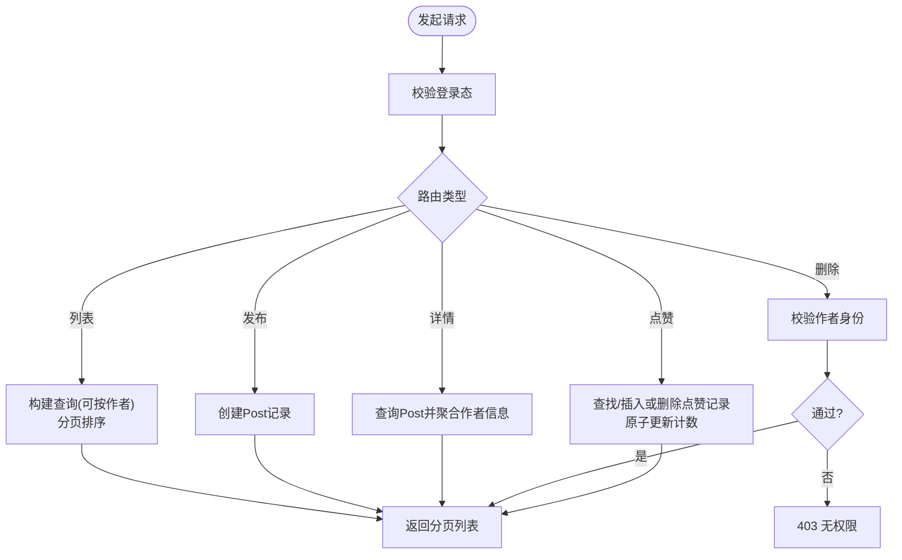
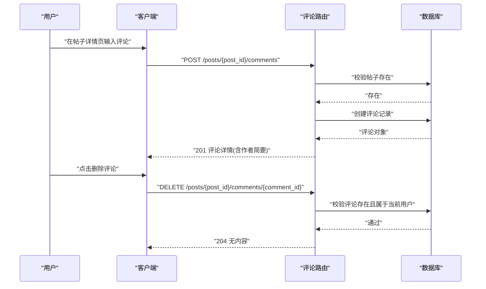
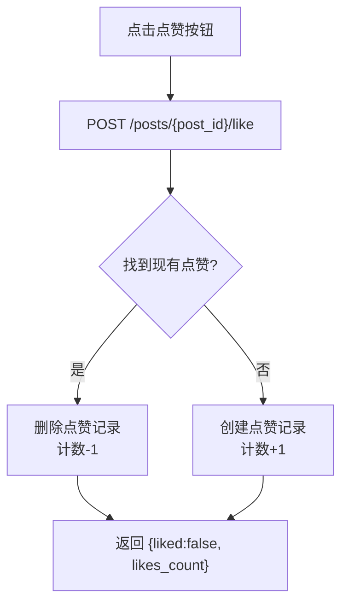
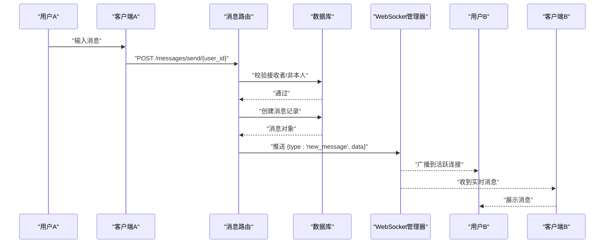
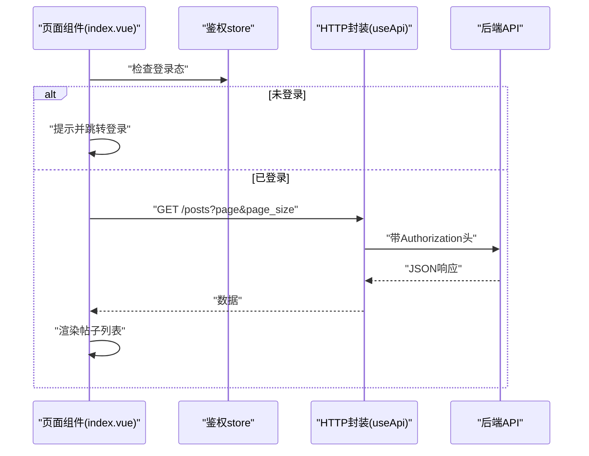
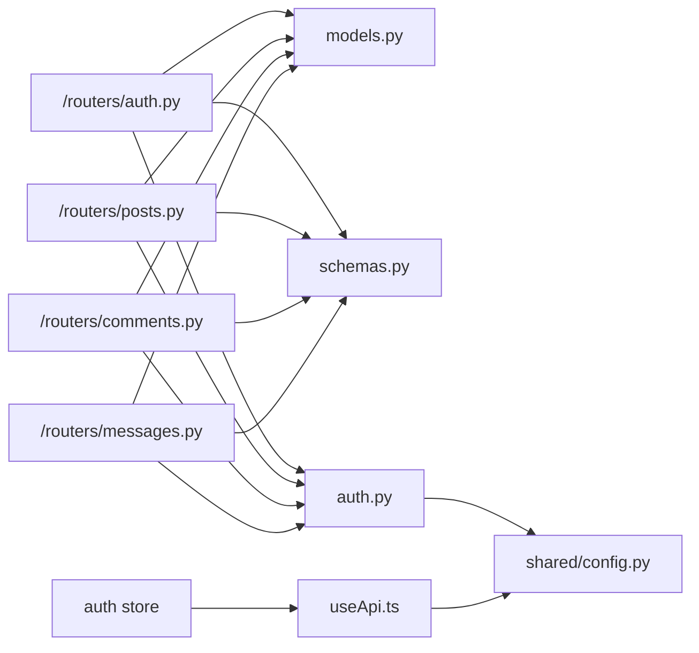

# 社交网络功能

<cite>
**本文引用的文件**
- [api_server/main.py](file://api_server/main.py)
- [api_server/database.py](file://api_server/database.py)
- [api_server/models.py](file://api_server/models.py)
- [api_server/schemas.py](file://api_server/schemas.py)
- [api_server/auth.py](file://api_server/auth.py)
- [api_server/routers/auth.py](file://api_server/routers/auth.py)
- [api_server/routers/users.py](file://api_server/routers/users.py)
- [api_server/routers/posts.py](file://api_server/routers/posts.py)
- [api_server/routers/comments.py](file://api_server/routers/comments.py)
- [api_server/routers/messages.py](file://api_server/routers/messages.py)
- [shared/config.py](file://shared/config.py)
- [web_frontend/composables/useApi.ts](file://web_frontend/composables/useApi.ts)
- [web_frontend/stores/auth.ts](file://web_frontend/stores/auth.ts)
- [web_frontend/pages/index.vue](file://web_frontend/pages/index.vue)
- [README.md](file://README.md)
</cite>

## 目录
1. [简介](#简介)
2. [项目结构](#项目结构)
3. [核心组件](#核心组件)
4. [架构总览](#架构总览)
5. [详细组件分析](#详细组件分析)
6. [依赖关系分析](#依赖关系分析)
7. [性能考虑](#性能考虑)
8. [故障排查指南](#故障排查指南)
9. [结论](#结论)
10. [附录](#附录)

## 简介
本文件面向“社交网络功能”的综合文档，覆盖用户认证系统、帖子发布与管理、评论互动、点赞系统、私信聊天等核心社交能力。文档解释RESTful API设计理念与实现细节（路由组织、数据验证、权限控制），并描述前后端数据交互模式（API调用方式、响应格式、错误处理）。同时提供功能使用指南与开发示例，帮助用户与开发者快速上手。

## 项目结构
后端基于 FastAPI，采用模块化路由组织；数据库使用 SQLAlchemy；前后端通过 HTTP/JSON 通信，并在私信场景引入 WebSocket 实时推送。共享配置集中于 settings，便于统一管理数据库、JWT、CORS、文件存储等参数。

图表来源
- [api_server/main.py](file://api_server/main.py#L1-L69)
- [api_server/routers/auth.py](file://api_server/routers/auth.py#L1-L78)
- [api_server/routers/posts.py](file://api_server/routers/posts.py#L1-L166)
- [api_server/routers/comments.py](file://api_server/routers/comments.py#L1-L121)
- [api_server/routers/messages.py](file://api_server/routers/messages.py#L1-L300)
- [api_server/models.py](file://api_server/models.py#L1-L293)
- [api_server/schemas.py](file://api_server/schemas.py#L1-L166)
- [api_server/auth.py](file://api_server/auth.py#L1-L89)
- [api_server/database.py](file://api_server/database.py#L1-L33)
- [shared/config.py](file://shared/config.py#L1-L52)
- [web_frontend/composables/useApi.ts](file://web_frontend/composables/useApi.ts#L1-L57)
- [web_frontend/stores/auth.ts](file://web_frontend/stores/auth.ts#L1-L80)
- [web_frontend/pages/index.vue](file://web_frontend/pages/index.vue#L1-L145)

章节来源
- [api_server/main.py](file://api_server/main.py#L1-L69)
- [README.md](file://README.md#L1-L290)

## 核心组件
- 应用入口与路由注册：统一创建 FastAPI 应用，配置 CORS，注册各模块路由。
- 数据库层：SQLAlchemy 基类与会话依赖，提供跨模块复用。
- 模型与验证：定义用户、帖子、评论、点赞、消息、群组等实体及关联；Pydantic 模型负责输入输出校验。
- 认证与授权：基于 JWT 的密码哈希、令牌签发与解析，依赖注入获取当前用户。
- 路由模块：按资源域划分（认证、用户、帖子、评论、消息），实现 CRUD 与业务逻辑。
- 前后端交互：HTTP 封装与鉴权状态管理，页面组件消费 API 并渲染。

章节来源
- [api_server/main.py](file://api_server/main.py#L15-L43)
- [api_server/database.py](file://api_server/database.py#L14-L33)
- [api_server/models.py](file://api_server/models.py#L35-L170)
- [api_server/schemas.py](file://api_server/schemas.py#L8-L166)
- [api_server/auth.py](file://api_server/auth.py#L24-L89)
- [api_server/routers/auth.py](file://api_server/routers/auth.py#L20-L78)
- [api_server/routers/posts.py](file://api_server/routers/posts.py#L45-L166)
- [api_server/routers/comments.py](file://api_server/routers/comments.py#L13-L121)
- [api_server/routers/messages.py](file://api_server/routers/messages.py#L83-L300)
- [web_frontend/composables/useApi.ts](file://web_frontend/composables/useApi.ts#L8-L57)
- [web_frontend/stores/auth.ts](file://web_frontend/stores/auth.ts#L18-L80)
- [web_frontend/pages/index.vue](file://web_frontend/pages/index.vue#L66-L133)

## 架构总览
后端以 FastAPI 为核心，通过依赖注入获取数据库会话，路由模块负责业务编排；认证中间件通过 OAuth2PasswordBearer 解析 Authorization 头中的 Bearer 令牌；前端通过封装的 HTTP 客户端携带令牌访问受保护接口；私信场景通过 WebSocket 实时推送消息。

图表来源
- [api_server/main.py](file://api_server/main.py#L24-L42)
- [api_server/routers/auth.py](file://api_server/routers/auth.py#L17-L78)
- [api_server/routers/posts.py](file://api_server/routers/posts.py#L11-L166)
- [api_server/routers/comments.py](file://api_server/routers/comments.py#L10-L121)
- [api_server/routers/messages.py](file://api_server/routers/messages.py#L14-L300)
- [api_server/auth.py](file://api_server/auth.py#L58-L89)
- [api_server/database.py](file://api_server/database.py#L26-L33)

## 详细组件分析

### 用户认证系统
- 注册：校验用户名唯一性，密码经哈希后保存，返回用户信息。
- 登录：根据用户名查询用户，校验密码哈希，签发 JWT 令牌。
- 当前用户：通过 OAuth2PasswordBearer 提取令牌，解析用户 ID，查询用户对象。
- 密码安全：bcrypt 哈希；令牌过期时间可配置；算法可配置。

图表来源
- [api_server/routers/auth.py](file://api_server/routers/auth.py#L20-L78)
- [api_server/auth.py](file://api_server/auth.py#L24-L89)
- [api_server/database.py](file://api_server/database.py#L26-L33)

章节来源
- [api_server/routers/auth.py](file://api_server/routers/auth.py#L20-L78)
- [api_server/auth.py](file://api_server/auth.py#L24-L89)
- [shared/config.py](file://shared/config.py#L14-L18)

### 帖子发布与管理
- 列表：支持分页、按作者过滤、按创建时间倒序；返回聚合后的帖子视图（含作者简要、评论数、是否点赞）。
- 发布：仅登录用户可发帖，填充作者 ID 与内容。
- 详情：按 ID 查询，返回聚合视图。
- 删除：仅作者本人可删，否则 403。
- 点赞：支持切换点赞/取消，原子更新计数与关联记录。

图表来源
- [api_server/routers/posts.py](file://api_server/routers/posts.py#L45-L166)
- [api_server/models.py](file://api_server/models.py#L80-L110)
- [api_server/schemas.py](file://api_server/schemas.py#L68-L98)

章节来源
- [api_server/routers/posts.py](file://api_server/routers/posts.py#L45-L166)
- [api_server/models.py](file://api_server/models.py#L80-L110)
- [api_server/schemas.py](file://api_server/schemas.py#L68-L98)

### 评论互动
- 列表：按帖子 ID 查询评论，支持分页与排序，返回作者简要信息。
- 发表：仅登录用户可评论，校验帖子存在性。
- 删除：仅评论作者可删，否则 403。

图表来源
- [api_server/routers/comments.py](file://api_server/routers/comments.py#L13-L121)
- [api_server/models.py](file://api_server/models.py#L112-L124)
- [api_server/schemas.py](file://api_server/schemas.py#L99-L124)

章节来源
- [api_server/routers/comments.py](file://api_server/routers/comments.py#L13-L121)
- [api_server/models.py](file://api_server/models.py#L112-L124)
- [api_server/schemas.py](file://api_server/schemas.py#L99-L124)

### 点赞系统
- 交互：调用 /posts/{post_id}/like，返回当前是否已点赞与最新计数。
- 权限：仅登录用户可操作。
- 并发：单条记录唯一约束避免重复点赞；原子增减计数。

图表来源
- [api_server/routers/posts.py](file://api_server/routers/posts.py#L131-L166)
- [api_server/models.py](file://api_server/models.py#L96-L110)
- [api_server/schemas.py](file://api_server/schemas.py#L125-L131)

章节来源
- [api_server/routers/posts.py](file://api_server/routers/posts.py#L131-L166)
- [api_server/models.py](file://api_server/models.py#L96-L110)
- [api_server/schemas.py](file://api_server/schemas.py#L125-L131)

### 私信聊天（私聊与WebSocket）
- 会话列表：按与当前用户相关的私聊消息，取最后一条消息与未读数。
- 历史消息：按时间倒序分页查询双方私聊记录。
- 发送消息：校验接收者存在且非本人，持久化后通过 WebSocket 推送给对方。
- 标记已读：批量将来自某用户的未读消息设为已读。
- 未读统计：统计当前用户未读私聊总数。
- WebSocket：基于查询参数 token 验证用户身份，心跳 ping/pong，断线清理。

图表来源
- [api_server/routers/messages.py](file://api_server/routers/messages.py#L18-L300)
- [api_server/models.py](file://api_server/models.py#L155-L170)
- [api_server/auth.py](file://api_server/auth.py#L46-L56)

章节来源
- [api_server/routers/messages.py](file://api_server/routers/messages.py#L83-L300)
- [api_server/models.py](file://api_server/models.py#L155-L170)
- [api_server/auth.py](file://api_server/auth.py#L46-L56)

### 前后端数据交互模式
- HTTP 封装：统一设置 Content-Type，按需附加 Authorization: Bearer token；处理 204 无内容；错误时解析 JSON 错误信息。
- 鉴权状态：Pinia store 管理 token 与用户信息，初始化从 localStorage 读取；登出清除。
- 页面组件：首页拉取帖子列表，支持下拉刷新与上滑加载；点赞时校验登录态并更新本地视图。

图表来源
- [web_frontend/pages/index.vue](file://web_frontend/pages/index.vue#L66-L133)
- [web_frontend/stores/auth.ts](file://web_frontend/stores/auth.ts#L57-L77)
- [web_frontend/composables/useApi.ts](file://web_frontend/composables/useApi.ts#L8-L57)

章节来源
- [web_frontend/composables/useApi.ts](file://web_frontend/composables/useApi.ts#L8-L57)
- [web_frontend/stores/auth.ts](file://web_frontend/stores/auth.ts#L18-L80)
- [web_frontend/pages/index.vue](file://web_frontend/pages/index.vue#L66-L133)

## 依赖关系分析
- 路由对模型与验证的依赖：路由层依赖 SQLAlchemy 模型与 Pydantic 模型进行数据映射与校验。
- 认证对配置的依赖：JWT 密钥、算法、过期时间来自共享配置。
- 前端对后端的依赖：通过统一的 baseURL 与 token 管理访问受保护接口。
- WebSocket 依赖：消息路由内部维护连接池，按用户 ID 推送消息。

图表来源
- [api_server/routers/auth.py](file://api_server/routers/auth.py#L1-L78)
- [api_server/routers/posts.py](file://api_server/routers/posts.py#L1-L166)
- [api_server/routers/comments.py](file://api_server/routers/comments.py#L1-L121)
- [api_server/routers/messages.py](file://api_server/routers/messages.py#L1-L300)
- [api_server/models.py](file://api_server/models.py#L1-L293)
- [api_server/schemas.py](file://api_server/schemas.py#L1-L166)
- [api_server/auth.py](file://api_server/auth.py#L1-L89)
- [shared/config.py](file://shared/config.py#L1-L52)
- [web_frontend/composables/useApi.ts](file://web_frontend/composables/useApi.ts#L1-L57)
- [web_frontend/stores/auth.ts](file://web_frontend/stores/auth.ts#L1-L80)

章节来源
- [api_server/routers/auth.py](file://api_server/routers/auth.py#L1-L78)
- [api_server/routers/posts.py](file://api_server/routers/posts.py#L1-L166)
- [api_server/routers/comments.py](file://api_server/routers/comments.py#L1-L121)
- [api_server/routers/messages.py](file://api_server/routers/messages.py#L1-L300)
- [api_server/models.py](file://api_server/models.py#L1-L293)
- [api_server/schemas.py](file://api_server/schemas.py#L1-L166)
- [api_server/auth.py](file://api_server/auth.py#L1-L89)
- [shared/config.py](file://shared/config.py#L1-L52)
- [web_frontend/composables/useApi.ts](file://web_frontend/composables/useApi.ts#L1-L57)
- [web_frontend/stores/auth.ts](file://web_frontend/stores/auth.ts#L1-L80)

## 性能考虑
- 分页与排序：列表接口支持分页与倒序，避免一次性加载过多数据。
- 关联预加载：帖子列表与详情使用 joinedload 预加载作者，减少 N+1 查询。
- 原子更新：点赞计数与关联记录的增删在事务内完成，保证一致性。
- WebSocket 连接池：按用户维护多连接，断线清理，降低无效推送。
- 缓存与索引：建议在高频查询列（如 created_at、author_id）建立索引；对热点数据可考虑应用层缓存。

## 故障排查指南
- 认证失败
  - 确认 Authorization 头格式正确（Bearer token）。
  - 检查 JWT 密钥、算法与过期时间配置。
  - 核对用户是否存在且密码哈希匹配。
- 权限不足
  - 删除帖子/评论需为作者本人，否则返回 403。
- 数据库连接
  - 检查数据库 URL、主机、端口、账号、密码。
  - 确认数据库服务运行与网络可达。
- CORS 问题
  - 确认前端地址已在允许列表中。
- WebSocket
  - 确认 token 参数有效且用户存在。
  - 检查心跳机制与断线重连策略。

章节来源
- [api_server/routers/posts.py](file://api_server/routers/posts.py#L107-L128)
- [api_server/routers/comments.py](file://api_server/routers/comments.py#L93-L121)
- [api_server/auth.py](file://api_server/auth.py#L58-L89)
- [api_server/main.py](file://api_server/main.py#L24-L34)
- [api_server/routers/messages.py](file://api_server/routers/messages.py#L263-L300)
- [shared/config.py](file://shared/config.py#L41-L42)

## 结论
该社交网络功能以清晰的模块化设计实现了认证、发帖、评论、点赞与私信等核心能力。后端通过 FastAPI、SQLAlchemy 与 Pydantic 构建了高内聚、低耦合的服务层；前端通过统一的 HTTP 封装与鉴权状态管理，提供了良好的用户体验。建议在生产环境中进一步完善缓存策略、监控告警与安全加固。

## 附录
- 快速启动与访问
  - 后端 API：http://localhost:8000，文档：http://localhost:8000/docs
  - 健康检查：http://localhost:8000/health
  - 前端开发：http://localhost:3000
- 常用端点概览
  - 认证：POST /auth/register、POST /auth/login、GET /auth/me
  - 用户：GET /users/{id}、PUT /users/me、GET /users
  - 帖子：GET /posts、POST /posts、GET /posts/{id}、DELETE /posts/{id}、POST /posts/{id}/like
  - 评论：GET /posts/{post_id}/comments、POST /posts/{post_id}/comments、DELETE /posts/{post_id}/comments/{comment_id}
  - 私信：GET /messages/conversations、GET /messages/history/{user_id}、POST /messages/send/{user_id}、POST /messages/read/{user_id}、GET /messages/unread_count、WebSocket /messages/ws?token={jwt}

章节来源
- [README.md](file://README.md#L100-L127)
- [README.md](file://README.md#L229-L243)
- [api_server/main.py](file://api_server/main.py#L45-L58)