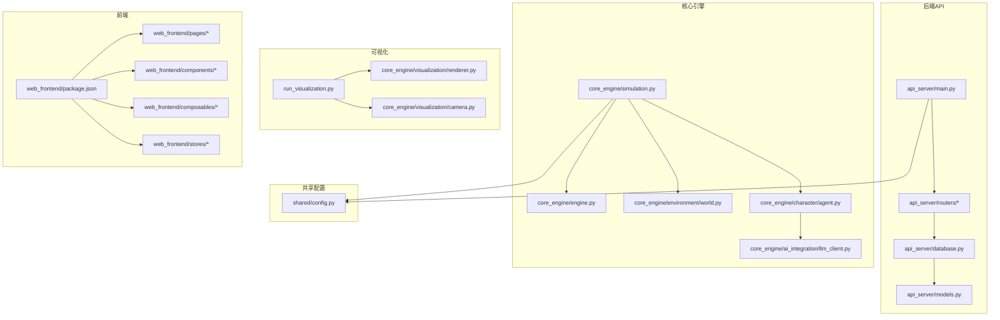
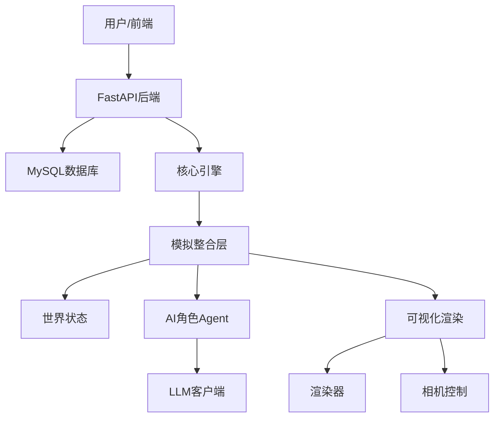
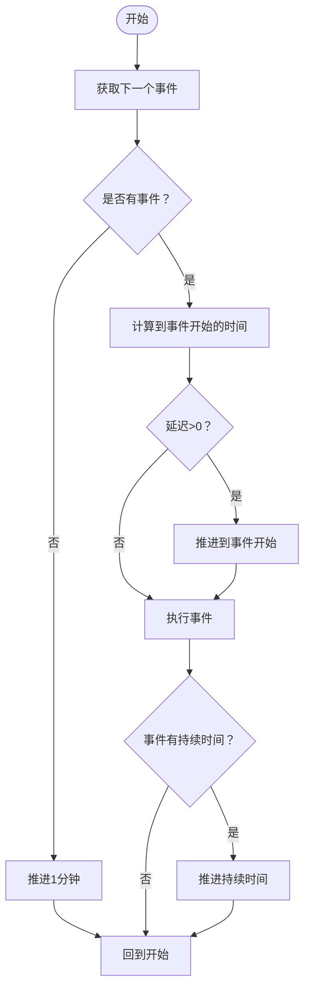
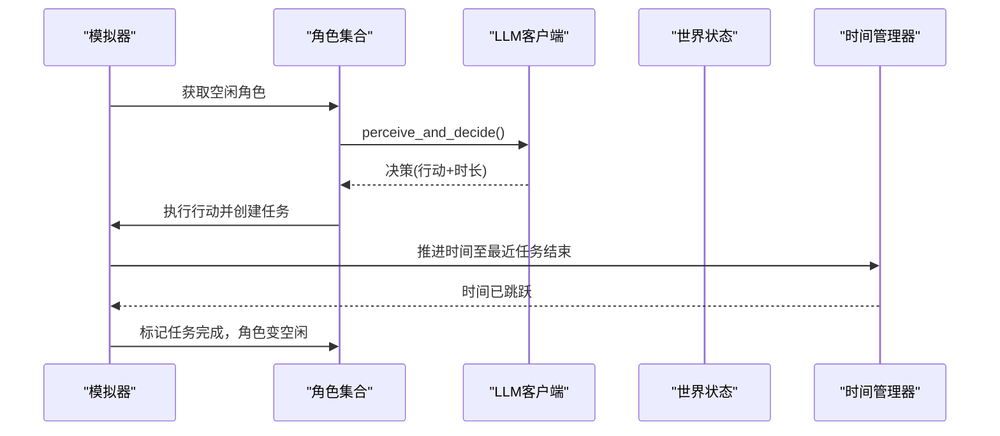
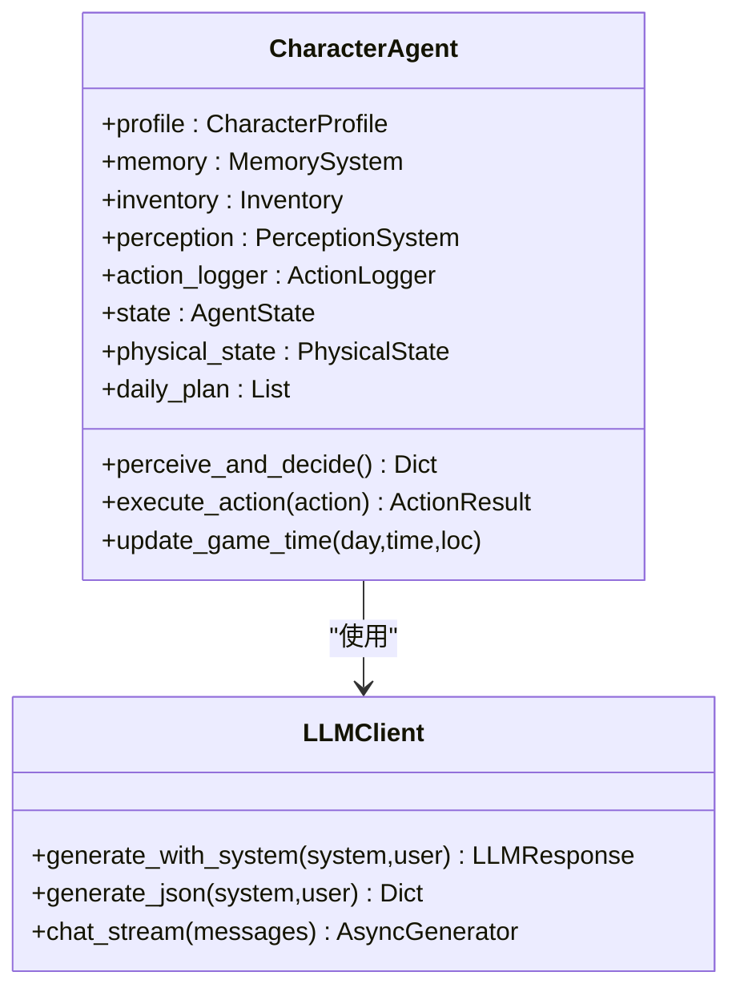
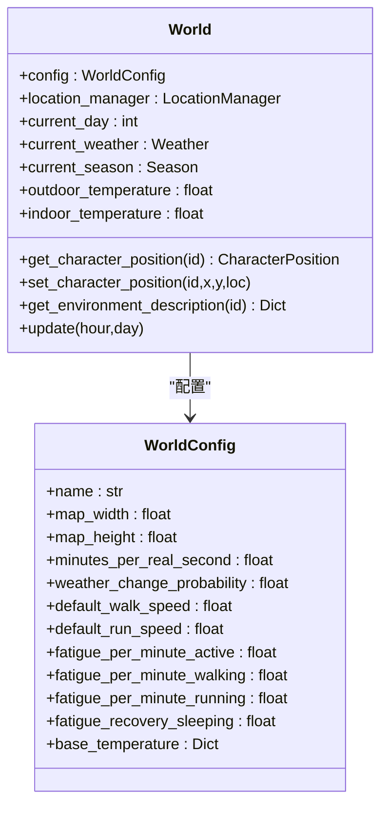
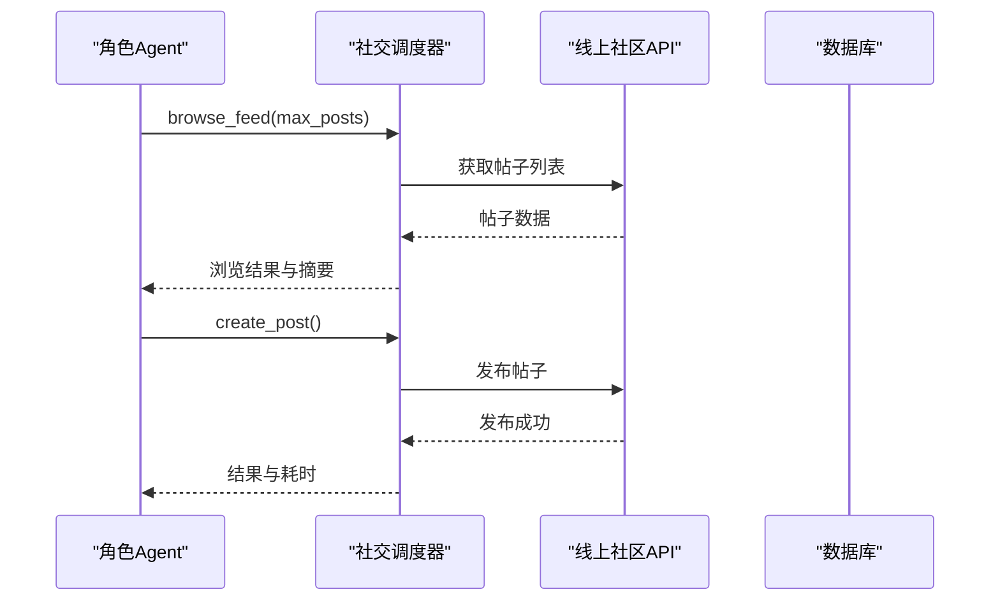
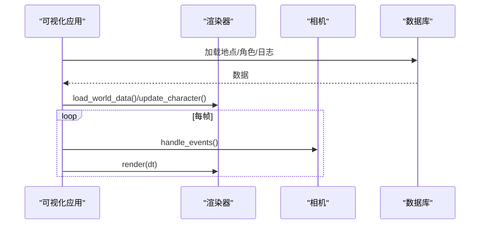
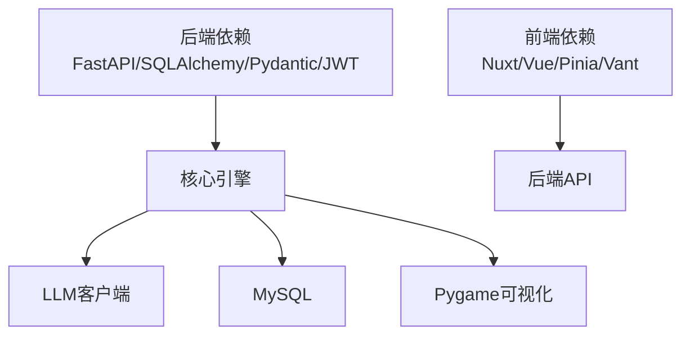

# 项目概述

<cite>
**本文档引用的文件**
- [README.md](file://README.md)
- [开发目标.md](file://开发目标.md)
- [开发进度.md](file://开发进度.md)
- [run_simulation.py](file://run_simulation.py)
- [run_visualization.py](file://run_visualization.py)
- [core_engine/engine.py](file://core_engine/engine.py)
- [core_engine/simulation.py](file://core_engine/simulation.py)
- [core_engine/character/agent.py](file://core_engine/character/agent.py)
- [core_engine/environment/world.py](file://core_engine/environment/world.py)
- [core_engine/ai_integration/llm_client.py](file://core_engine/ai_integration/llm_client.py)
- [api_server/main.py](file://api_server/main.py)
- [api_server/models.py](file://api_server/models.py)
- [shared/config.py](file://shared/config.py)
- [requirements.txt](file://requirements.txt)
- [web_frontend/package.json](file://web_frontend/package.json)
</cite>

## 目录
1. [简介](#简介)
2. [项目结构](#项目结构)
3. [核心组件](#核心组件)
4. [架构总览](#架构总览)
5. [详细组件分析](#详细组件分析)
6. [依赖关系分析](#依赖关系分析)
7. [性能考量](#性能考量)
8. [故障排查指南](#故障排查指南)
9. [结论](#结论)
10. [附录](#附录)

## 简介
本项目旨在构建一个可在本地运行的2D拟真AI社区模拟系统，融合“线下”实体社区与“线上”社交网络，形成一个事件驱动、AI角色自主决策的仿真环境。系统通过本地LLM（如LM Studio）驱动AI角色的感知、记忆与行为，结合事件队列与时间管理器实现高效的时间推进与并发决策，最终以Pygame可视化呈现世界状态与角色动态。

项目核心目标：
- 实现线下社区与线上社交网络的融合，使AI角色在线下空间移动、在线上平台互动。
- 基于事件驱动的时间模型，角色空闲时由AI决策下一步行动，所有角色忙碌时自动时间跳跃到最近的行动结束点。
- 提供2D可视化界面，展示世界状态、角色位置、行动日志与角色详情。
- 通过FastAPI提供线上社区的REST API，支撑用户注册、登录、发帖、评论、私信等社交功能。

## 项目结构
项目采用分层与功能域划分相结合的组织方式：
- 后端API服务：FastAPI + SQLAlchemy，提供REST接口与数据库交互。
- 核心引擎：事件驱动的时间管理器、世界状态、AI角色Agent与社交行为调度。
- 可视化系统：Pygame渲染器、相机控制与UI面板。
- 前端：Nuxt 3 + Vue 3 + Vant，移动端友好的社交平台界面。
- 共享配置：统一的环境变量与配置管理。

图表来源
- [api_server/main.py](file://api_server/main.py#L1-L69)
- [core_engine/simulation.py](file://core_engine/simulation.py#L64-L114)
- [core_engine/engine.py](file://core_engine/engine.py#L167-L210)
- [core_engine/environment/world.py](file://core_engine/environment/world.py#L93-L121)
- [core_engine/character/agent.py](file://core_engine/character/agent.py#L116-L175)
- [core_engine/ai_integration/llm_client.py](file://core_engine/ai_integration/llm_client.py#L54-L80)
- [run_visualization.py](file://run_visualization.py#L208-L280)
- [shared/config.py](file://shared/config.py#L6-L52)

章节来源
- [README.md](file://README.md#L1-L35)
- [开发进度.md](file://开发进度.md#L228-L311)

## 核心组件
- 事件驱动时间管理器：负责游戏时间推进、事件调度与暂停/恢复控制，支持回调钩子与状态持久化。
- 模拟整合层：连接引擎、世界与角色，实现基于行动结束触发的模拟，支持时间跳跃与手动步进。
- AI角色Agent：整合记忆、感知、决策与行动执行，通过LLM生成JSON格式的行动决策。
- 世界状态：管理天气、季节、温度与角色位置，提供环境描述辅助AI决策。
- LLM客户端：提供OpenAI兼容接口，支持同步与流式响应、JSON解析与自动重试。
- 可视化系统：Pygame渲染器、相机控制与UI面板，展示世界状态、角色与行动日志。
- 线上社区API：FastAPI提供用户、帖子、评论、文件与消息接口，支持JWT认证与CORS。

章节来源
- [core_engine/engine.py](file://core_engine/engine.py#L167-L429)
- [core_engine/simulation.py](file://core_engine/simulation.py#L64-L529)
- [core_engine/character/agent.py](file://core_engine/character/agent.py#L116-L800)
- [core_engine/environment/world.py](file://core_engine/environment/world.py#L93-L342)
- [core_engine/ai_integration/llm_client.py](file://core_engine/ai_integration/llm_client.py#L54-L351)
- [run_visualization.py](file://run_visualization.py#L208-L439)
- [api_server/main.py](file://api_server/main.py#L1-L69)

## 架构总览
系统采用“事件驱动 + AI决策 + 可视化”的三层架构：
- 顶层：线上社区API与前端，提供社交功能入口。
- 中层：核心引擎与AI角色，负责时间推进、事件调度与角色行为。
- 底层：数据库与可视化渲染，持久化状态与展示世界。

图表来源
- [api_server/main.py](file://api_server/main.py#L15-L43)
- [core_engine/simulation.py](file://core_engine/simulation.py#L64-L114)
- [core_engine/engine.py](file://core_engine/engine.py#L167-L210)
- [core_engine/ai_integration/llm_client.py](file://core_engine/ai_integration/llm_client.py#L54-L80)
- [run_visualization.py](file://run_visualization.py#L208-L280)

## 详细组件分析

### 事件驱动时间管理器
- 职责：维护游戏时间（分钟粒度）、调度事件、推进时间、暂停/恢复控制与状态持久化。
- 关键特性：支持回调钩子（每tick、日期变更、事件完成）、事件冲突检测、状态序列化/反序列化。
- 时间推进策略：若队列为空推进1分钟；否则推进到下一个事件开始；事件完成后根据持续时间再次推进。

图表来源
- [core_engine/engine.py](file://core_engine/engine.py#L288-L382)

章节来源
- [core_engine/engine.py](file://core_engine/engine.py#L167-L429)

### 模拟整合层（基于行动结束触发）
- 职责：连接引擎、世界与角色，实现“角色空闲→AI决策→行动→时间跳跃→行动结束→角色空闲”的闭环。
- 关键机制：任务堆（按结束时间排序）、并行触发空闲角色决策、时间跳跃到最近任务结束点。
- 支持手动步进与自动运行，提供状态查询与回调钩子。

图表来源
- [core_engine/simulation.py](file://core_engine/simulation.py#L220-L395)
- [core_engine/character/agent.py](file://core_engine/character/agent.py#L358-L477)
- [core_engine/engine.py](file://core_engine/engine.py#L320-L382)

章节来源
- [core_engine/simulation.py](file://core_engine/simulation.py#L64-L529)
- [run_simulation.py](file://run_simulation.py#L54-L186)

### AI角色Agent（感知-决策-执行）
- 职责：构建系统提示词、环境感知、决策制定（JSON格式）、行动执行与日志记录。
- 决策流程：感知环境→填充关系记忆→生成可用行动→构造决策提示→LLM生成JSON→解析并执行→记录日志与消耗疲劳。
- 支持注册自定义行动处理器，内置常用行动（移动、浏览、发帖、私信、对话等）。

图表来源
- [core_engine/character/agent.py](file://core_engine/character/agent.py#L116-L175)
- [core_engine/ai_integration/llm_client.py](file://core_engine/ai_integration/llm_client.py#L228-L300)

章节来源
- [core_engine/character/agent.py](file://core_engine/character/agent.py#L116-L800)
- [core_engine/ai_integration/llm_client.py](file://core_engine/ai_integration/llm_client.py#L54-L351)

### 世界状态与环境系统
- 职责：管理天气、季节、温度与角色位置，提供环境描述辅助AI决策。
- 功能：按季节与天气概率变化、日间温度曲线、角色位置跟踪、附近角色与地点查询、相遇检测。

图表来源
- [core_engine/environment/world.py](file://core_engine/environment/world.py#L93-L140)
- [core_engine/environment/world.py](file://core_engine/environment/world.py#L33-L65)

章节来源
- [core_engine/environment/world.py](file://core_engine/environment/world.py#L93-L342)

### LLM客户端与社交行为
- LLM客户端：OpenAI兼容接口，支持同步/流式响应、JSON解析、自动重试与连接检查。
- 社交行为：通过社交调度器实现AI的浏览、点赞、评论、发帖、私聊与线下相遇对话。

图表来源
- [core_engine/character/agent.py](file://core_engine/character/agent.py#L657-L698)
- [core_engine/ai_integration/llm_client.py](file://core_engine/ai_integration/llm_client.py#L106-L171)

章节来源
- [core_engine/ai_integration/llm_client.py](file://core_engine/ai_integration/llm_client.py#L54-L351)
- [api_server/main.py](file://api_server/main.py#L1-L69)

### 2D可视化系统
- 职责：Pygame渲染器展示世界状态、地点与角色，相机控制支持拖拽平移与滚轮缩放，UI面板显示时间、天气、角色详情与行动日志。
- 数据来源：从数据库加载地点与角色，或演示模式生成示例数据；定期刷新行动日志与选中角色详情。

图表来源
- [run_visualization.py](file://run_visualization.py#L208-L439)
- [run_visualization.py](file://run_visualization.py#L281-L314)

章节来源
- [run_visualization.py](file://run_visualization.py#L208-L439)

## 依赖关系分析
- 技术栈选择：
  - 后端：FastAPI（Web框架）、SQLAlchemy（ORM）、PyMySQL（驱动）、Pydantic（数据验证）、python-jose（JWT）。
  - 前端：Nuxt 3（Vue 3）、Pinia（状态管理）、Vant（移动端UI）。
  - AI模拟：asyncio/aiohttp（异步HTTP与调度）、LM Studio（本地LLM服务）。
- 外部依赖：MySQL（数据库）、pygame（可视化）、aiohttp（异步HTTP）。

图表来源
- [requirements.txt](file://requirements.txt#L1-L32)
- [web_frontend/package.json](file://web_frontend/package.json#L13-L27)

章节来源
- [requirements.txt](file://requirements.txt#L1-L32)
- [web_frontend/package.json](file://web_frontend/package.json#L1-L28)

## 性能考量
- 事件驱动与时间跳跃：避免空转，提升大规模AI角色并发决策效率。
- 异步I/O：LLM与数据库访问采用异步，降低阻塞风险。
- 可视化优化：Pygame渲染按需刷新，相机裁剪减少绘制开销。
- 决策超时与重试：防止LLM长时间无响应，保障系统稳定性。
- 数据库连接池：建议在生产环境配置连接池与索引优化。

## 故障排查指南
- LLM连接失败：
  - 确认LM Studio已启动并加载模型，检查端口与base_url配置。
  - 使用测试脚本验证连接与可用模型。
- 数据库连接失败：
  - 确认MySQL服务运行、凭据正确、数据库存在。
  - 初始化数据库脚本确保表结构正确。
- 没有AI角色：
  - 在用户表中创建is_ai=True的用户记录，模拟器将自动加载。
- 可视化无法启动：
  - 确认pygame安装，必要时使用演示模式验证数据加载。
- API健康检查：
  - 访问健康端点确认服务正常运行。

章节来源
- [README.md](file://README.md#L269-L286)
- [core_engine/ai_integration/llm_client.py](file://core_engine/ai_integration/llm_client.py#L319-L351)
- [api_server/main.py](file://api_server/main.py#L55-L58)

## 结论
本项目通过事件驱动的时间管理、AI角色的感知-决策-执行闭环与2D可视化展示，实现了线下与线上社区的有机融合。系统具备良好的扩展性与模块化设计，既适合教学演示，也为进一步引入生图系统、群聊与消息通知等高级功能奠定了坚实基础。

## 附录
- 快速开始与命令：
  - 后端：uvicorn启动API服务，访问文档与健康检查端点。
  - 前端：Nuxt开发服务器，移动端友好界面。
  - 可视化：演示模式或数据库模式加载数据，支持交互操作。
  - 模拟器：交互模式与手动步进模式，支持状态查询与时间跳跃。

章节来源
- [README.md](file://README.md#L100-L156)
- [开发进度.md](file://开发进度.md#L315-L353)