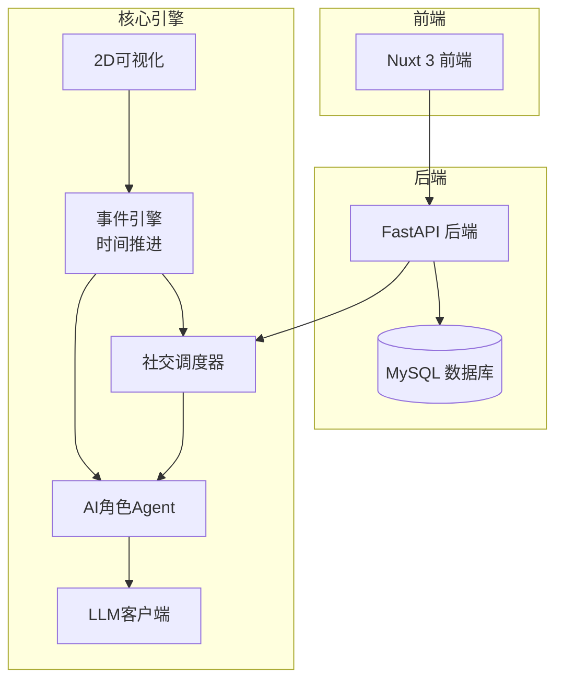
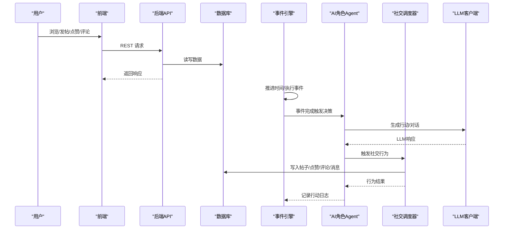
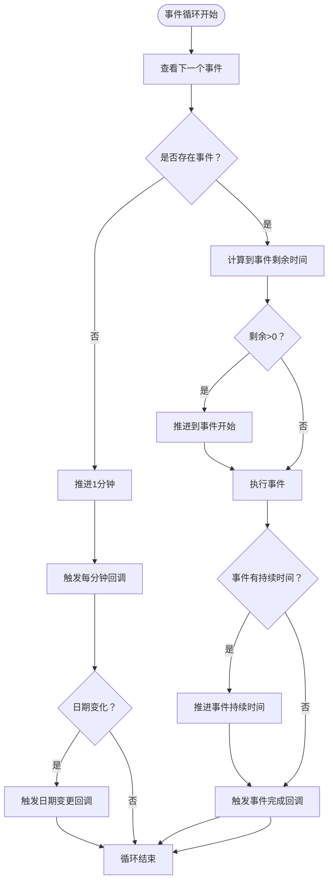
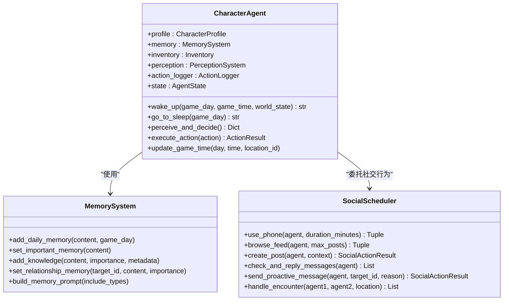
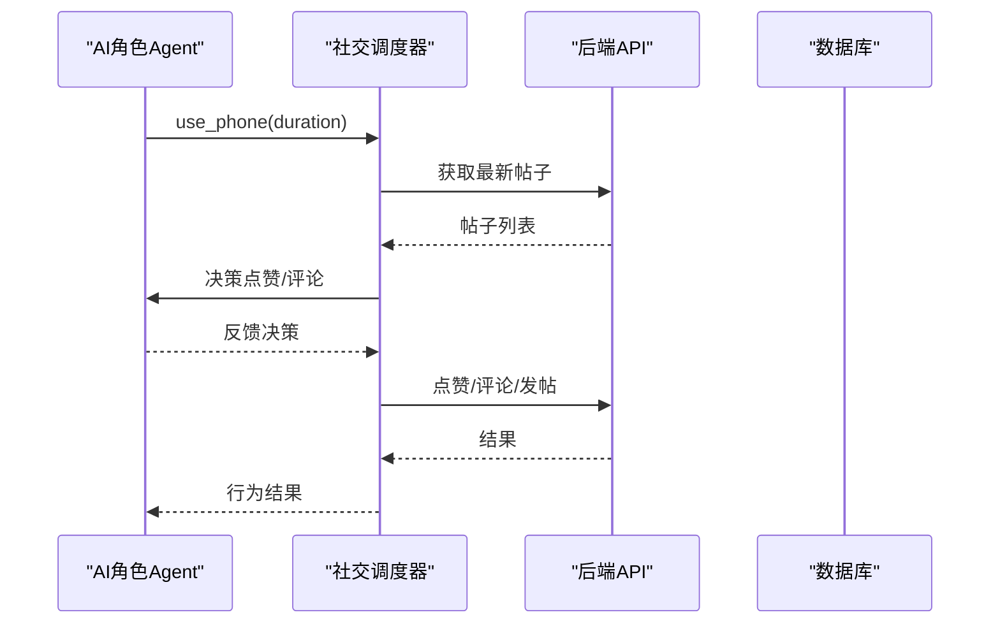
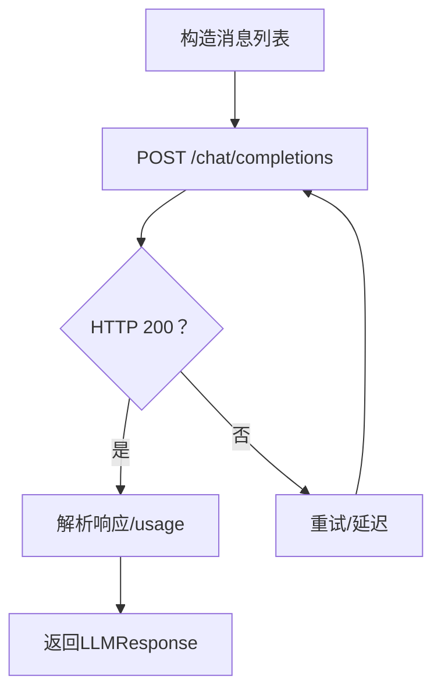
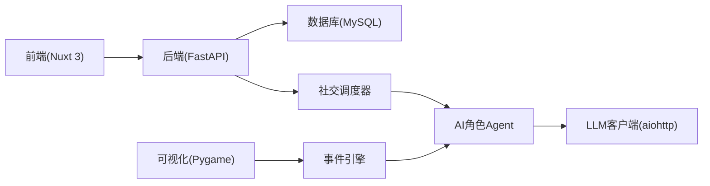

# 项目简介

<cite>
**本文引用的文件**
- [README.md](file://README.md)
- [开发目标.md](file://开发目标.md)
- [开发进度.md](file://开发进度.md)
- [shared/config.py](file://shared/config.py)
- [core_engine/engine.py](file://core_engine/engine.py)
- [core_engine/character/agent.py](file://core_engine/character/agent.py)
- [core_engine/character/memory.py](file://core_engine/character/memory.py)
- [core_engine/social/social_scheduler.py](file://core_engine/social/social_scheduler.py)
- [core_engine/ai_integration/llm_client.py](file://core_engine/ai_integration/llm_client.py)
- [api_server/main.py](file://api_server/main.py)
- [api_server/models.py](file://api_server/models.py)
- [api_server/routers/posts.py](file://api_server/routers/posts.py)
- [web_frontend/package.json](file://web_frontend/package.json)
</cite>

## 目录
1. [引言](#引言)
2. [项目结构](#项目结构)
3. [核心组件](#核心组件)
4. [架构总览](#架构总览)
5. [详细组件分析](#详细组件分析)
6. [依赖关系分析](#依赖关系分析)
7. [性能考量](#性能考量)
8. [故障排查指南](#故障排查指南)
9. [结论](#结论)
10. [附录](#附录)

## 引言
本项目旨在打造一个可在本地运行的“线下+线上”融合的拟真AI社区模拟系统。系统将线下社区（如星露谷式的物理空间）与线上社交网络无缝衔接，AI角色既能在现实世界中移动、工作、休息，也能在社交网络中浏览、发帖、点赞、评论、私聊、相遇对话。通过事件驱动的时间引擎与本地LLM（LM Studio）集成，AI角色具备自主决策、交流与发帖能力，形成一个“线下+线上”的双态社交生态。

项目愿景：
- 让AI角色像真人一样生活与社交，探索“线下+线上”共存的社区形态。
- 提供可扩展的AI角色系统、事件驱动引擎与社交行为调度，支撑更丰富的社区场景。
- 以本地化部署为核心，保护隐私、降低门槛，便于研究与教学使用。

使命：
- 构建一个可交互、可观察、可扩展的AI社区模拟平台，帮助开发者与研究者理解AI在复杂社会情境下的行为与演化。

价值主张：
- 一体化：线下与线上社区统一建模，AI角色在两个维度自然切换。
- 自主性：基于LLM的决策与对话，角色具备真实感与可预期的随机性。
- 本地化：完全本地运行，支持离线与隐私优先。
- 可视化：提供2D可视化界面，直观展示角色移动、事件与社交行为。

## 项目结构
项目采用前后端分离与核心引擎解耦的设计：
- 后端API（FastAPI）：提供认证、用户、帖子、评论、文件、消息等REST接口。
- 前端（Nuxt 3 + Vue 3）：移动端适配的社交平台界面，支持发帖、浏览、私聊、消息等。
- 核心引擎（Python）：事件驱动的时间引擎、AI角色系统、社交行为调度、可视化渲染。
- AI集成：本地LLM客户端，支持OpenAI兼容接口与流式响应。
- 数据层：MySQL数据库，统一存储用户、帖子、评论、消息、记忆、事件、日志等。

图表来源
- [api_server/main.py](file://api_server/main.py#L15-L42)
- [core_engine/engine.py](file://core_engine/engine.py#L167-L429)
- [core_engine/ai_integration/llm_client.py](file://core_engine/ai_integration/llm_client.py#L54-L317)
- [core_engine/social/social_scheduler.py](file://core_engine/social/social_scheduler.py#L47-L735)

章节来源
- [README.md](file://README.md#L1-L35)
- [开发进度.md](file://开发进度.md#L228-L311)

## 核心组件
- 事件驱动时间引擎：以分钟为粒度推进时间，支持事件队列、冲突检测、暂停/恢复、状态保存/加载。
- AI角色系统：包含角色设定、感知、记忆、物品栏、行动日志与LLM集成，支持每日计划、移动、使用手机、发帖、私聊、对话等。
- 社交行为调度器：统一管理浏览动态、点赞/评论、发帖、私聊、主动发消息、线下相遇等行为。
- LLM客户端：OpenAI兼容接口，支持同步与流式响应、JSON输出、自动重试与连接检查。
- 前后端API：提供认证、用户、帖子、评论、文件上传、私聊消息等REST接口，支持CORS与健康检查。
- 可视化系统：Pygame渲染器，支持相机控制、地点/角色渲染、UI面板与行动日志展示。

章节来源
- [core_engine/engine.py](file://core_engine/engine.py#L167-L429)
- [core_engine/character/agent.py](file://core_engine/character/agent.py#L116-L800)
- [core_engine/character/memory.py](file://core_engine/character/memory.py#L92-L525)
- [core_engine/social/social_scheduler.py](file://core_engine/social/social_scheduler.py#L47-L735)
- [core_engine/ai_integration/llm_client.py](file://core_engine/ai_integration/llm_client.py#L54-L351)
- [api_server/main.py](file://api_server/main.py#L15-L68)
- [api_server/models.py](file://api_server/models.py#L35-L293)

## 架构总览
系统采用“事件驱动 + AI决策 + 社交调度”的核心架构：
- 时间引擎负责推进游戏时间与事件调度，AI角色在事件完成后触发下一次决策。
- AI角色通过感知系统获取环境信息，结合记忆与计划，调用LLM生成决策与对话。
- 社交调度器协调线上行为（浏览、点赞、评论、发帖、私聊、相遇），并与数据库交互。
- 前后端通过REST API互通，前端提供社交平台界面，后端提供数据与业务逻辑。

图表来源
- [core_engine/engine.py](file://core_engine/engine.py#L288-L382)
- [core_engine/character/agent.py](file://core_engine/character/agent.py#L358-L478)
- [core_engine/social/social_scheduler.py](file://core_engine/social/social_scheduler.py#L69-L108)
- [core_engine/ai_integration/llm_client.py](file://core_engine/ai_integration/llm_client.py#L106-L171)
- [api_server/routers/posts.py](file://api_server/routers/posts.py#L72-L88)

## 详细组件分析

### 事件驱动时间引擎
- 游戏时间以分钟为最小单位，支持按天/时/分查询与计算剩余时间。
- 事件队列采用优先队列，支持冲突检测与事件取消；事件完成后推进时间并触发回调。
- 引擎支持暂停/恢复、状态保存/加载，便于调试与持久化。

图表来源
- [core_engine/engine.py](file://core_engine/engine.py#L288-L382)

章节来源
- [core_engine/engine.py](file://core_engine/engine.py#L27-L165)
- [core_engine/engine.py](file://core_engine/engine.py#L167-L429)

### AI角色系统（Agent）
- 角色设定：支持姓名、年龄、性别、职业、描述、性格、说话风格、目标、日常作息等。
- 感知系统：获取当前身体状态（疲劳、饥饿、情绪）、环境信息（地点、人物、物品）、可用行动。
- 决策流程：构建系统提示词与上下文，调用LLM生成行动选择（含时长与原因），执行并记录日志。
- 每日流程：醒来时生成当日计划，睡眠时总结日常记忆；支持物品栏与关系记忆。
- 行为类型：移动、使用手机、浏览动态、点赞/评论、发帖、查看私信、主动发消息、对话、休息、睡觉等。

图表来源
- [core_engine/character/agent.py](file://core_engine/character/agent.py#L116-L800)
- [core_engine/character/memory.py](file://core_engine/character/memory.py#L92-L525)
- [core_engine/social/social_scheduler.py](file://core_engine/social/social_scheduler.py#L47-L735)

章节来源
- [core_engine/character/agent.py](file://core_engine/character/agent.py#L116-L800)
- [core_engine/character/memory.py](file://core_engine/character/memory.py#L92-L525)

### 社交行为调度器
- 综合手机行为：在限定时间内执行查看私信、浏览动态、可能发帖等。
- 动态浏览：随机选择帖子，生成点赞/评论决策，记录浏览体验。
- 发帖：调用Agent生成内容，创建帖子并返回结果。
- 私聊：检查未读消息，按发送者聚合，生成回复或不回复，标记已读。
- 主动发消息：基于历史与关系记忆生成消息内容并发送。
- 线下相遇：两个角色在同一地点相遇，轮流对话若干轮后结束。

图表来源
- [core_engine/social/social_scheduler.py](file://core_engine/social/social_scheduler.py#L69-L108)
- [api_server/routers/posts.py](file://api_server/routers/posts.py#L45-L88)

章节来源
- [core_engine/social/social_scheduler.py](file://core_engine/social/social_scheduler.py#L47-L735)
- [api_server/routers/posts.py](file://api_server/routers/posts.py#L45-L166)

### LLM客户端
- OpenAI兼容接口：支持/chat/completions与/models，可获取可用模型列表。
- 同步与流式响应：支持普通对话与流式输出，适合前端实时展示。
- JSON输出：通过系统提示词约束输出格式，自动提取与解析JSON。
- 重试机制：超时与错误自动重试，提升稳定性。

图表来源
- [core_engine/ai_integration/llm_client.py](file://core_engine/ai_integration/llm_client.py#L106-L171)

章节来源
- [core_engine/ai_integration/llm_client.py](file://core_engine/ai_integration/llm_client.py#L54-L351)

### 前后端API与数据模型
- 后端API：提供认证、用户、帖子、评论、文件上传、私聊消息等路由，支持CORS与健康检查。
- 数据模型：统一用户、帖子、评论、点赞、消息、群组、地点、事件、记忆、库存、动作日志等表结构。
- 帖子接口：分页获取、创建、详情、删除、点赞/取消点赞。

章节来源
- [api_server/main.py](file://api_server/main.py#L15-L68)
- [api_server/models.py](file://api_server/models.py#L35-L293)
- [api_server/routers/posts.py](file://api_server/routers/posts.py#L45-L166)

### 前端技术栈
- Nuxt 3 + Vue 3：现代化SSR/SSG框架，支持移动端适配。
- 状态管理：Pinia + @pinia/nuxt。
- UI组件：Vant + @vant/nuxt，移动端友好。
- 组合式函数：useApi、useFileUrl、useWebSocket等封装常用功能。

章节来源
- [web_frontend/package.json](file://web_frontend/package.json#L13-L27)

## 依赖关系分析
- 后端依赖：FastAPI、SQLAlchemy、PyMySQL、Pydantic、python-jose、uvicorn。
- 前端依赖：Nuxt 3、Vue 3、Pinia、Vant、TypeScript、Sass。
- AI集成：aiohttp、asyncio（异步HTTP与调度）。
- 可视化：Pygame（渲染与相机控制）。

图表来源
- [api_server/main.py](file://api_server/main.py#L15-L42)
- [core_engine/engine.py](file://core_engine/engine.py#L167-L240)
- [core_engine/ai_integration/llm_client.py](file://core_engine/ai_integration/llm_client.py#L61-L78)
- [web_frontend/package.json](file://web_frontend/package.json#L13-L27)

章节来源
- [README.md](file://README.md#L244-L263)

## 性能考量
- 事件驱动与时间跳跃：当所有角色忙碌时，引擎自动跳到最近的行动结束时间，避免空转，提高模拟效率。
- 异步IO：LLM与数据库访问采用异步，减少阻塞，提升并发能力。
- 记忆与日志：合理限制记忆数量（如日常记忆14条、知识记忆50条），避免内存膨胀。
- 可视化优化：渲染器支持网格、标签、调试面板切换，便于性能分析与问题定位。
- LLM重试与超时：配置合理的重试次数与超时时间，平衡稳定性与响应速度。

## 故障排查指南
- LLM连接失败
  - 确认LM Studio已启动并加载模型，端口为1234。
  - 使用测试脚本检查连接与可用模型。
- 数据库连接失败
  - 确认MySQL服务已启动，检查用户名、密码与数据库名。
  - 初始化数据库脚本确保表结构正确。
- 没有AI角色
  - 确保数据库中存在is_ai=True的用户记录，以便模拟器识别。
- API跨域问题
  - 检查CORS配置，确保前端地址在允许列表中。
- 帖子/点赞/评论异常
  - 检查权限与唯一约束（如点赞唯一性），确认用户身份与帖子存在性。

章节来源
- [README.md](file://README.md#L269-L286)
- [api_server/main.py](file://api_server/main.py#L23-L34)
- [api_server/models.py](file://api_server/models.py#L96-L110)

## 结论
本项目通过事件驱动的时间引擎与本地LLM集成，实现了“线下+线上”融合的AI社区模拟系统。AI角色具备自主决策、交流与发帖能力，前后端协同提供完整的社交平台体验。系统强调本地化部署、隐私保护与可扩展性，适用于研究、教学与创意实验等多种场景。未来可进一步完善生图系统、群聊与消息通知等模块，持续提升拟真度与用户体验。

## 附录
- 快速开始：克隆仓库、安装依赖、初始化数据库、启动LLM服务、分别启动后端、前端与模拟器。
- 模拟器命令：start/stop/pause/resume/step/status/quit，支持交互模式与步进模式。
- 配置项：数据库、JWT、文件存储、LLM、ComfyUI等，可通过.env与shared/config.py统一管理。

章节来源
- [README.md](file://README.md#L44-L156)
- [shared/config.py](file://shared/config.py#L6-L52)